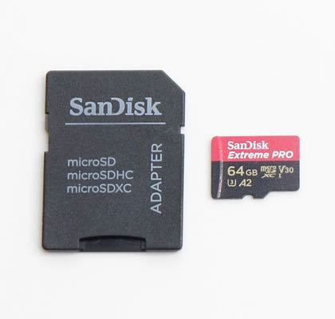

# Edge AI Kit ２GBモデル内容物

FaBo Edge AI Kit 2GB BOM

対象モデル

|コード番号|
|:--|
|EAK2-1|

※開封後はすぐ欠品がないかご確認お願いいたします。

※予告なく、仕様、外観、価格は変更する場合がございます。

写真|部品|個数|
|:--|:--|:--|
||NVIDIA Jetson Nano 2GB 開発者キット  ※本体BootROMアップデートのため開封済み|１台|
||FaBo #519 Jetson Nano AI Edge OUT/IN Board|１枚|
||FaBo #103 Button  ※1KΩプルアップ版|３個|
||FaBo #116 Distance|１個|
||FaBo #128 LED2 赤|１個|
||FaBo #128 LED2 青|１個|
||FaBo #128 LED2 緑|１個|
||FaBo #202 3Axis|１個|
||FaBo #203 Color|１個|
||マイクロサーボ SG90|２個|
||FaBo 3pinケーブル|３本|
||FaBo 4pinケーブル|２本|
||AC600ハイパワーデュアルバンド無線LAN子機|１台|
||ロジクール ウェブカメラ C270n ブラック HD 720P|１台|
||Smraza RaspberryPi4 USB-CラズベリーACアダプター|１個|
||USBケーブル0.9m(2.0タイプAオス - マイクロBケーブル)|１本|
||microSDカード　６４GB|１枚|
||SDカードケース|１個|
