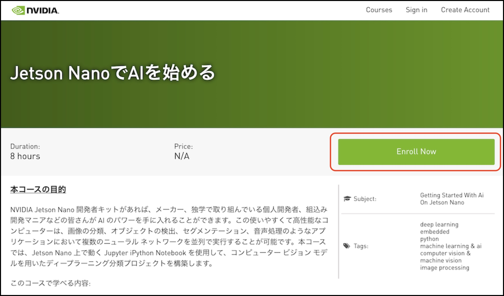

# 最初に受講するコース

JetsonでのAIの使い方をマスターするために、まず Deep Learning Institude(DLI)の[Jetson NanoでAIを始める](https://courses.nvidia.com/courses/course-v1:DLI+C-RX-02+V1-JA/about)講座を受講します。

|コース名称|URL|
|:--|:--|
|Jetson NanoでAIを始める|[https://courses.nvidia.com/courses/course-v1:DLI+C-RX-02+V1-JA/about](https://courses.nvidia.com/courses/course-v1:DLI+C-RX-02+V1-JA/about)|

Enroll Nowで受講登録をし、受講を開始します。受講の最後にテストが実施されます。テストを受けて合格するまで続けてください。
