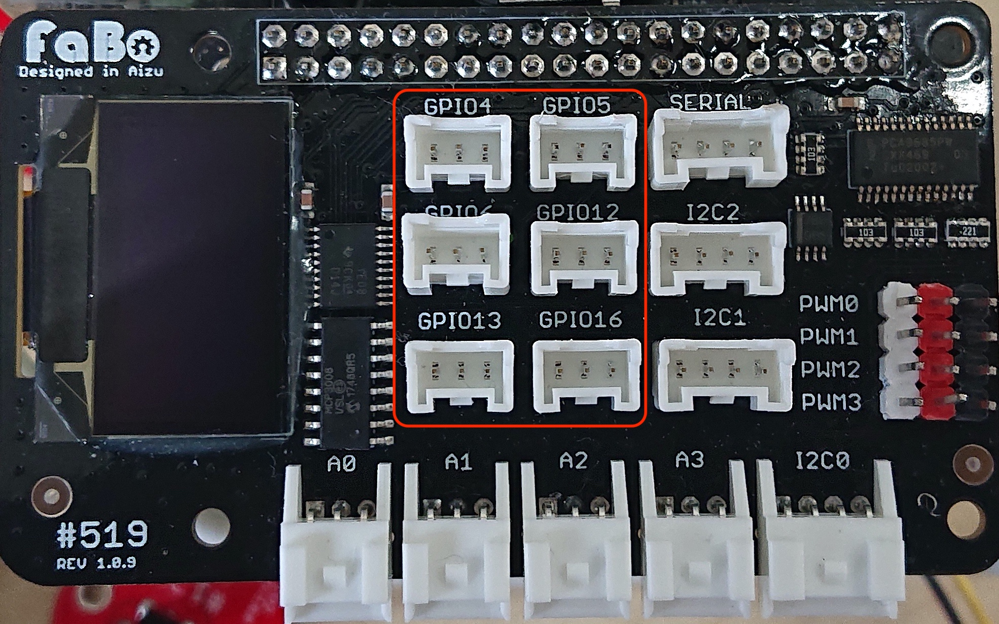

# 107 limitswitch

FaBo #107 limitswitch Brickを使用してスイッチをおしたら、LED点灯させます。
LED BrickをGPIO４に接続、BUTTON Brickは、GPIO5に接続します。

GPIOは4,5,6,12,13,16



GPIOの判定

以下のコードは、ボタンが押されたのたえずチェックします。

```
# coding: utf-8
import RPi.GPIO as GPIO
import time

LEDPIN = 4
LSPIN = 5   #LimitSwitch pin

led_state = 0

GPIO.setwarnings(False)
GPIO.setmode( GPIO.BCM )
GPIO.setup( LEDPIN, GPIO.OUT )
GPIO.setup( LSPIN, GPIO.IN)

try:
    while True:
        if( GPIO.input( LSPIN ) ):
            led_state = 1 - led_state
            GPIO.output( LEDPIN, led_state )
            print "led_state: %d " % led_state
            time.sleep(0.2)
except KeyboardInterrupt:
    GPIO.cleanup()
    sys.exit(0)
```
