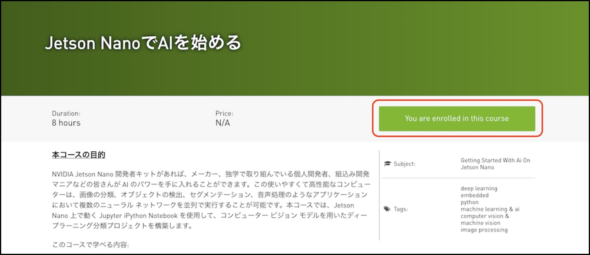
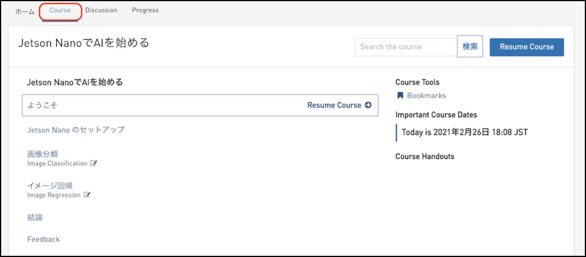

# 進め方

DLIの[Jetson NanoでAIを始める](https://courses.nvidia.com/courses/course-v1:DLI+C-RX-02+V1-JA/about)のページに移動します。

``You are enrolled in this course``のボタンをクリックし、教材のページに移動します。s

``Course``の項目を選択します。

各項目を選択し、上から順番にすすめていきます。

|項目|内容|
|:--|:--|
|ようこそ|講習内容の説明|
|Jetson Nanoのセットアップ|Jetsonの設定|
|画像分類|画像分類のデータセットの作成、学習、認識|
|イメージ回帰|画像回帰のデータセットの作成、学習、認識|
|結論|最終試験|

