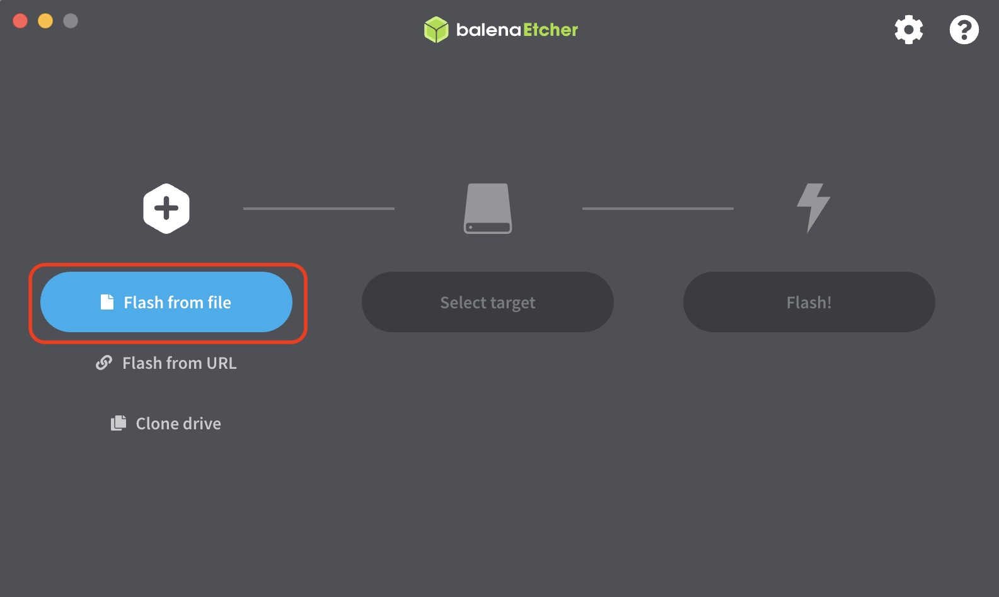
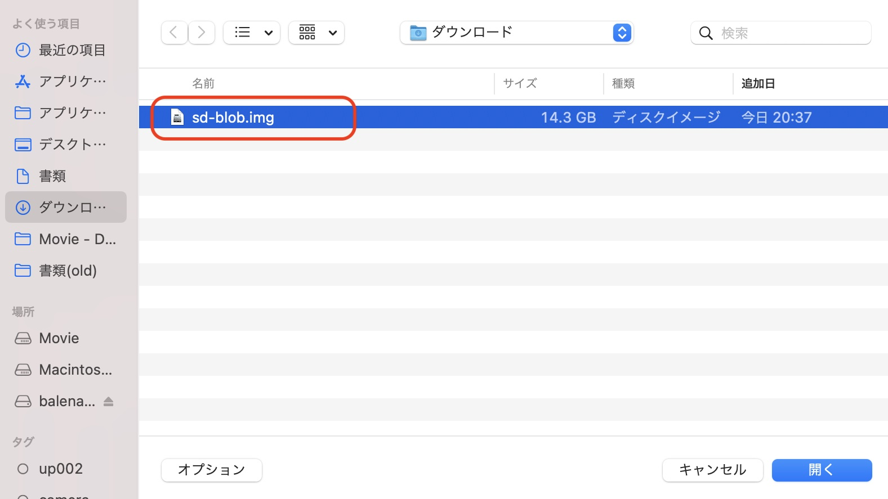
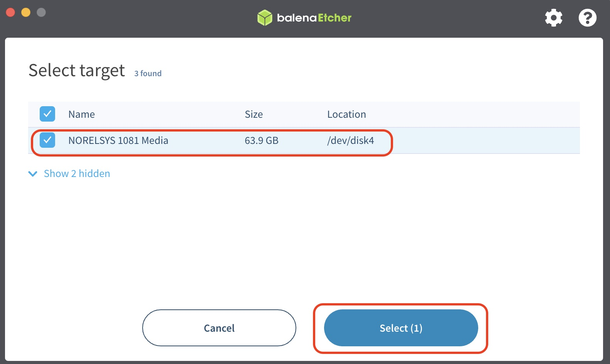
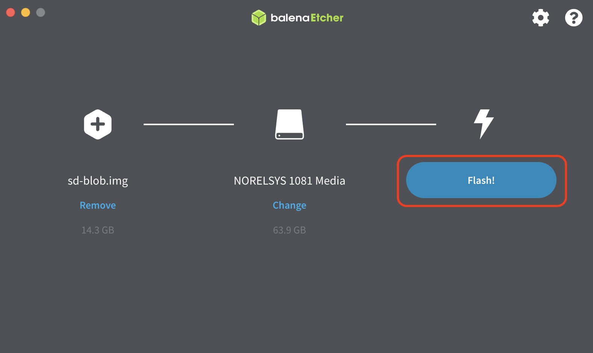
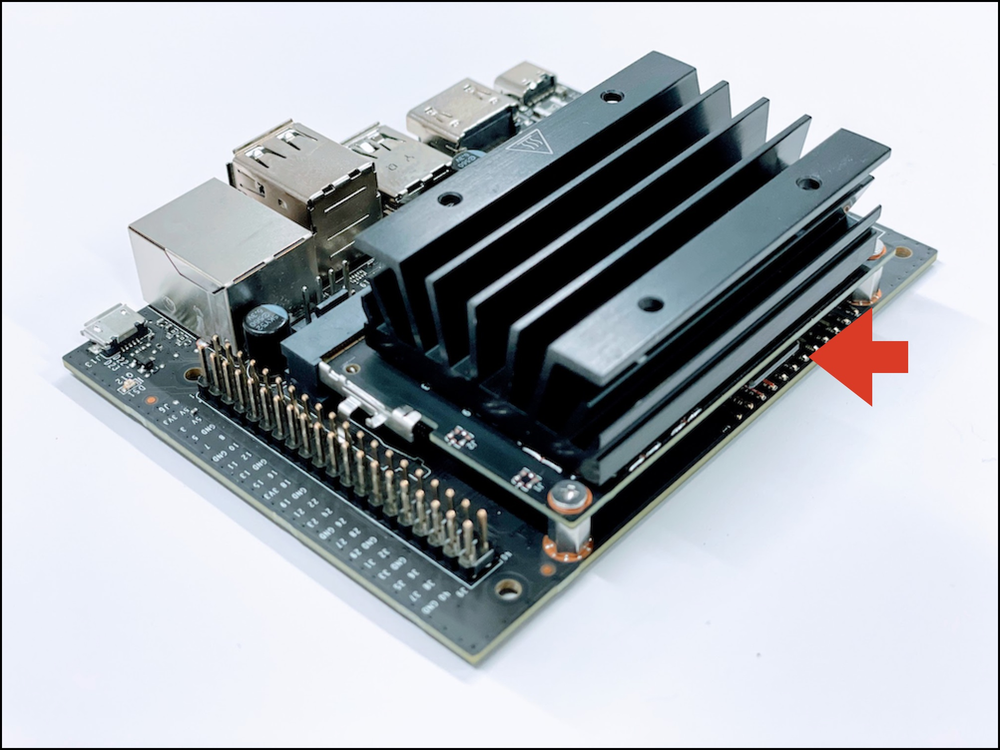
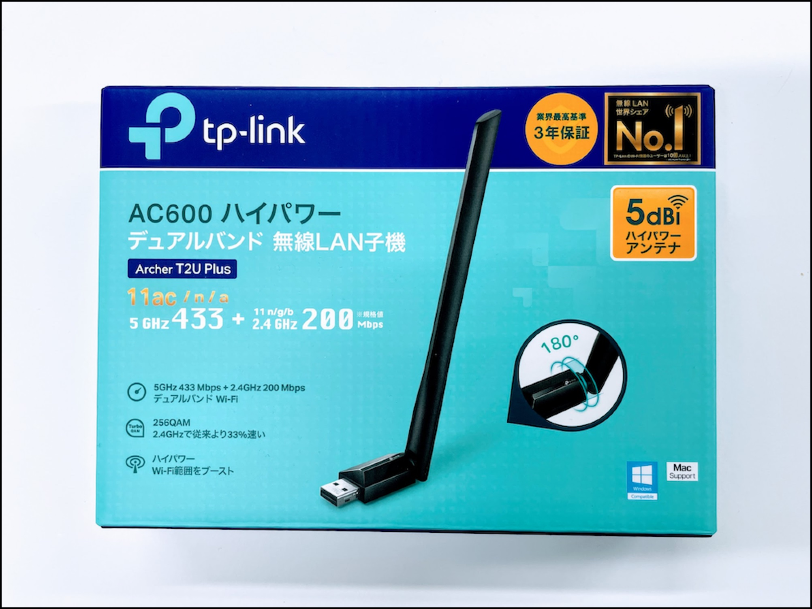
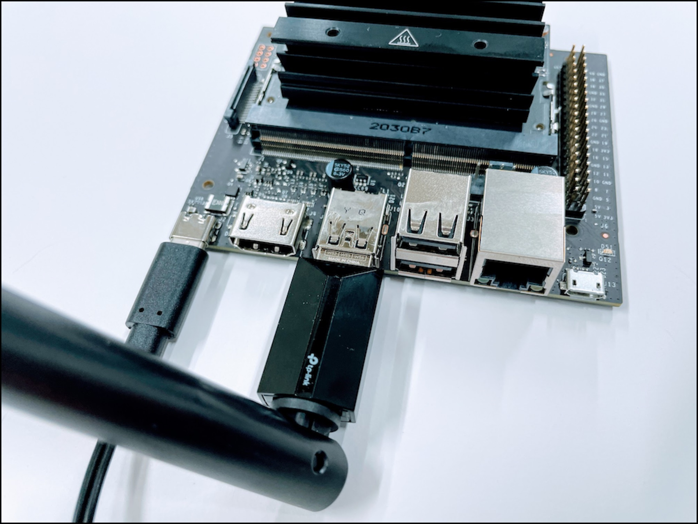
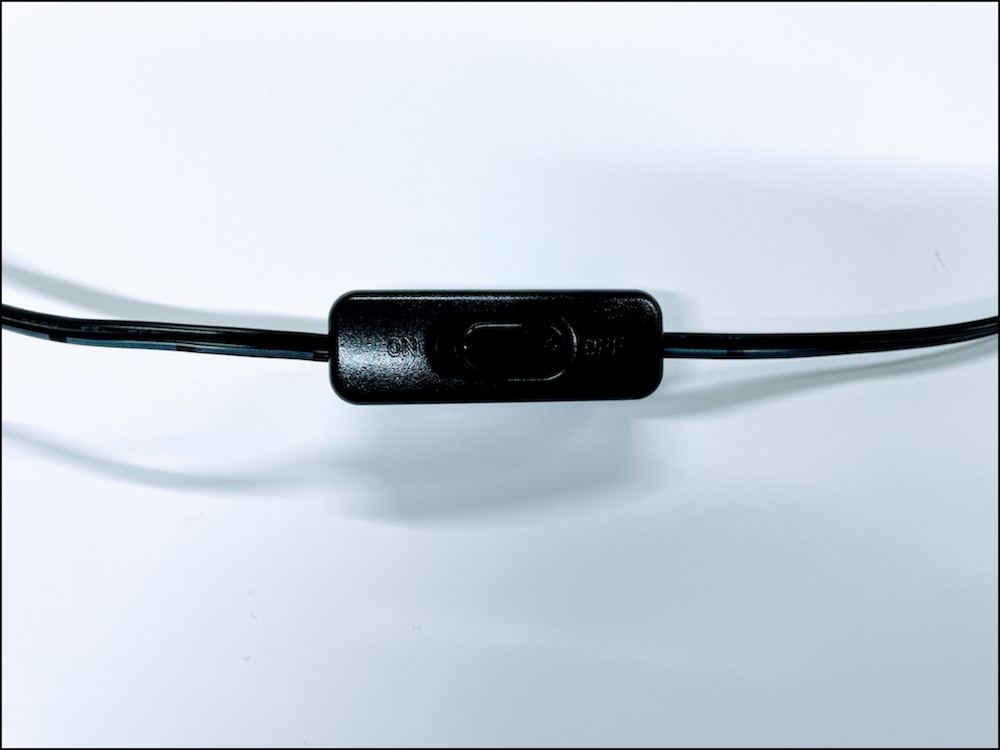
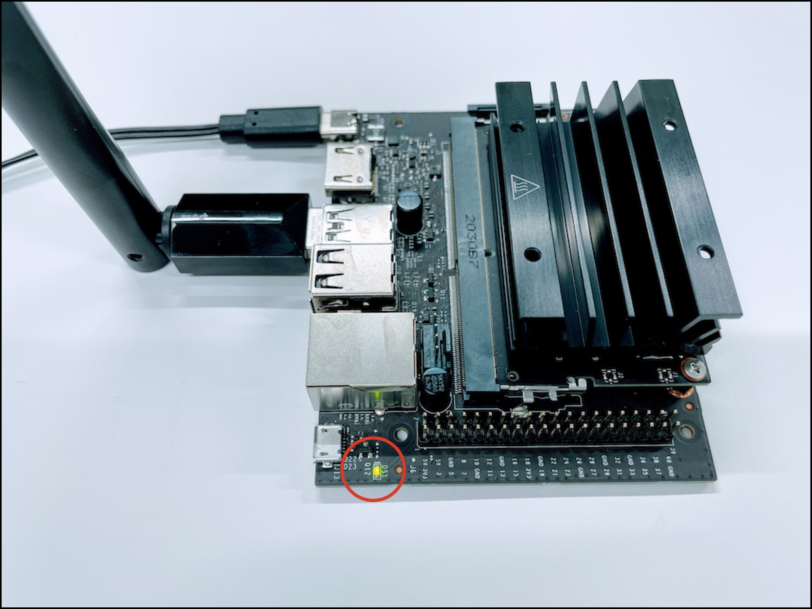

# セットアップ①

## 本項目の注意点

本項目では、SDカードの作成からJupyterの起動までの方法を解説しています。

## SDカードの焼き込みツール

SDカードの焼き込みにはEtcherを使用します。
[https://www.balena.io/etcher/](https://www.balena.io/etcher/)

## SDカードイメージ

NVIDIAのページより最新のSDカードイメージをダウンロードしてきます。

[https://developer.nvidia.com/jetson-nano-2gb-sd-card-image](https://developer.nvidia.com/jetson-nano-2gb-sd-card-image)

jetson-nano-2gb-jp4##-sd-card-image.zipがダウンロードされるので、解凍すると、sd-blob.imgが現れます。

## イメージのSDカードへの焼き込み

## Jetson Nanoの起動

## 電源の接続(USB Type-C)

## WiFiドングル

## Power On

電源をOnにします。

LEDが点灯すればOKです。

