# セットアップ②

## 接続

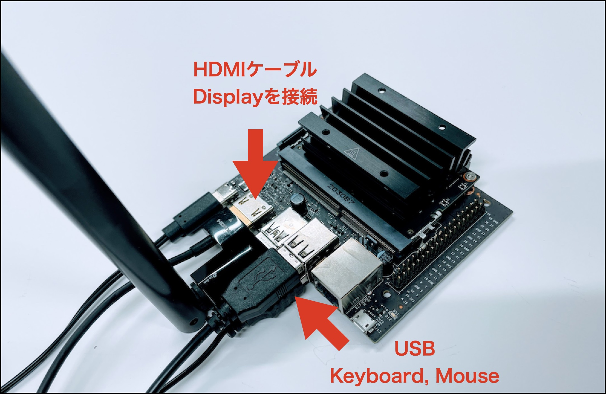

## 初期設定

Jetson NanoにKeyboard, mouseを接続し、Displayに接続します。

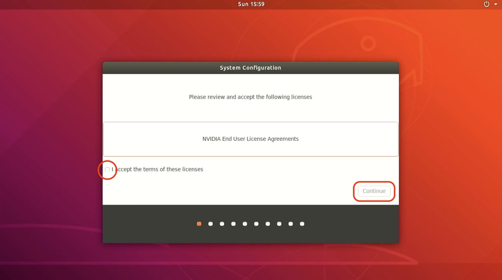

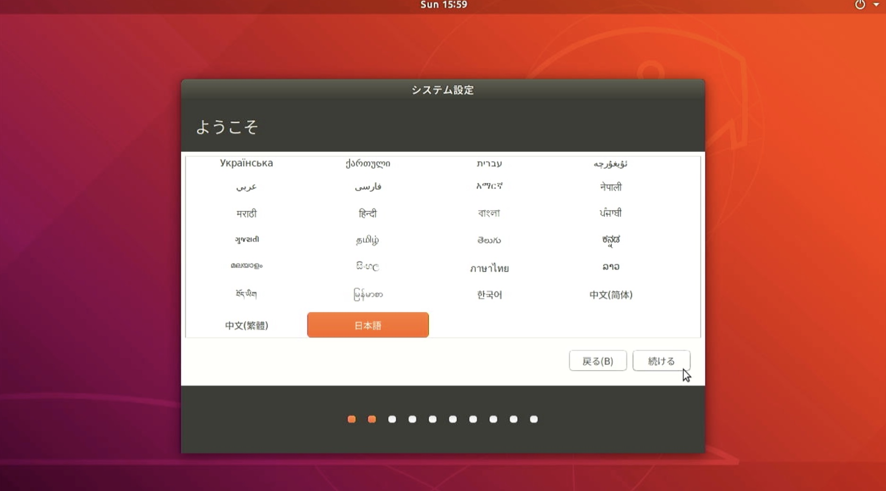

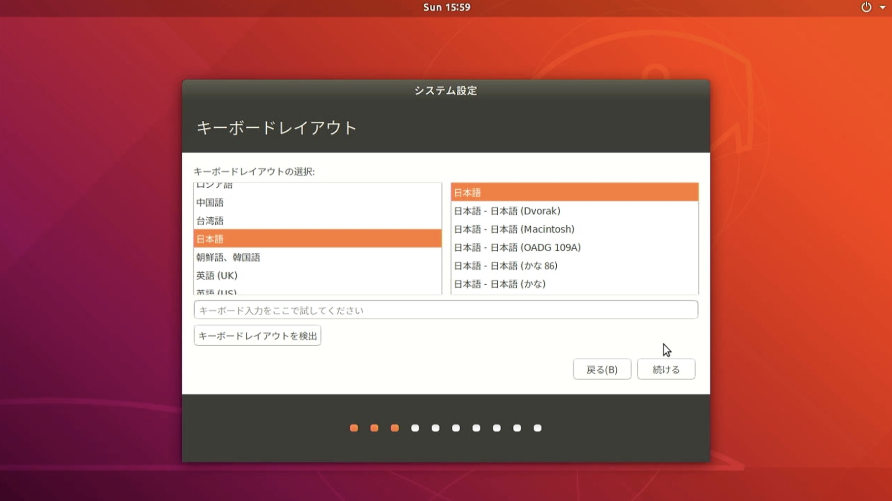

このタイミングでWi-Fiに接続しておきましょう。Wi-Fiのスポットを選び、Wi-Fiのパスワードを入力します。

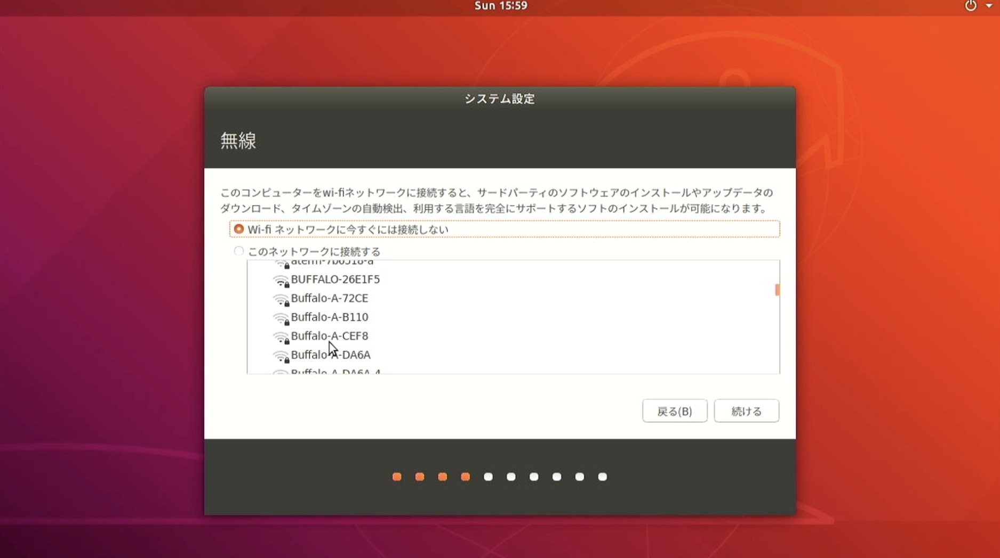

システムにログインするためのID, Passwordを設定します。以後のログインで使いますので、忘れないようにしてください。
ここの例では、ID: jetson, PASSWORD: jetsonを設定します。

|id|pass|
|:--|:--|
|jetson|jetson|

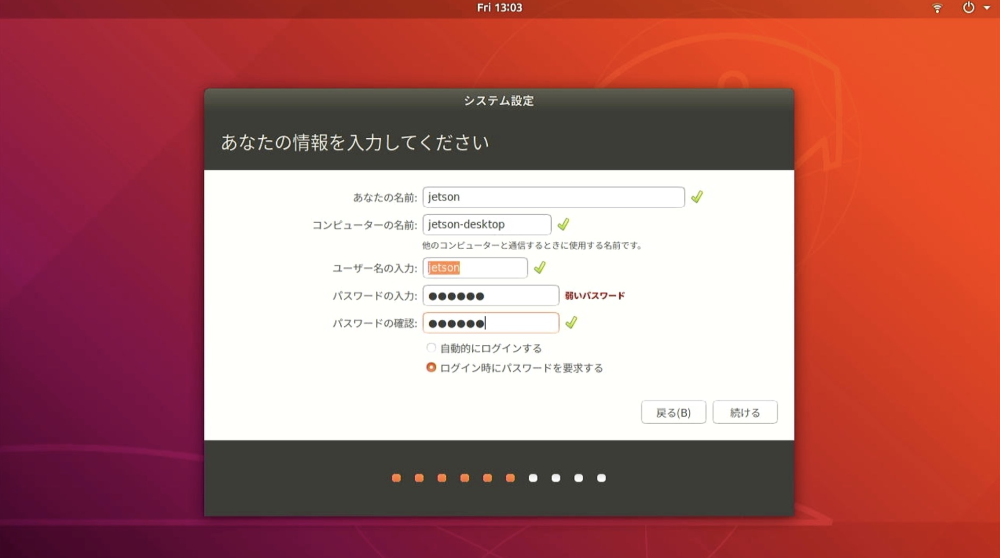

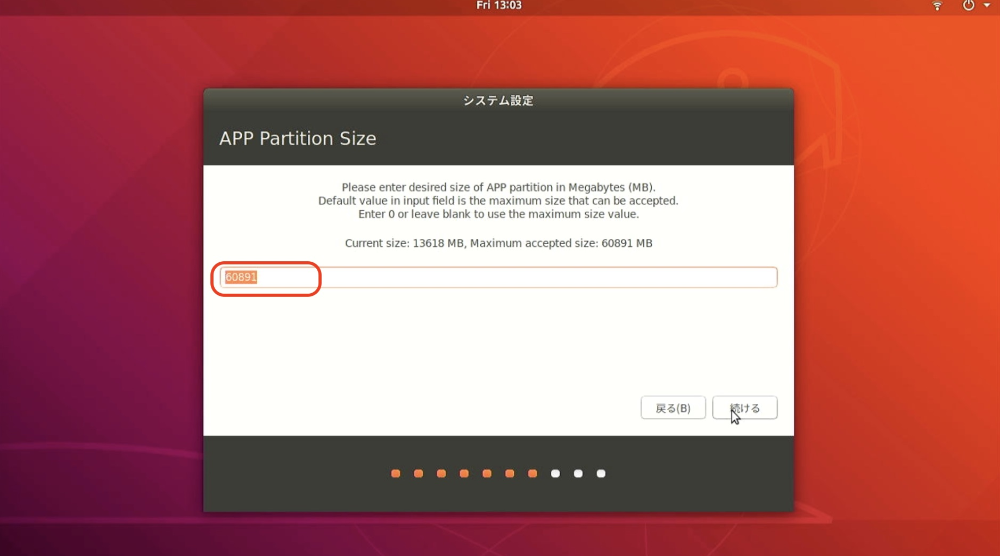

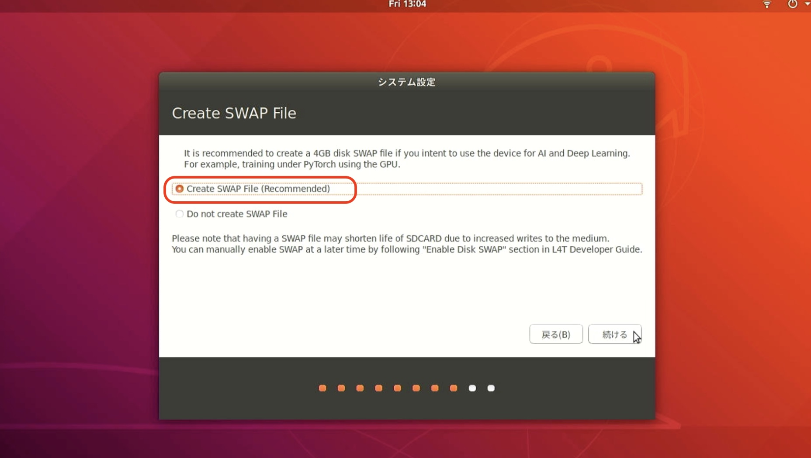

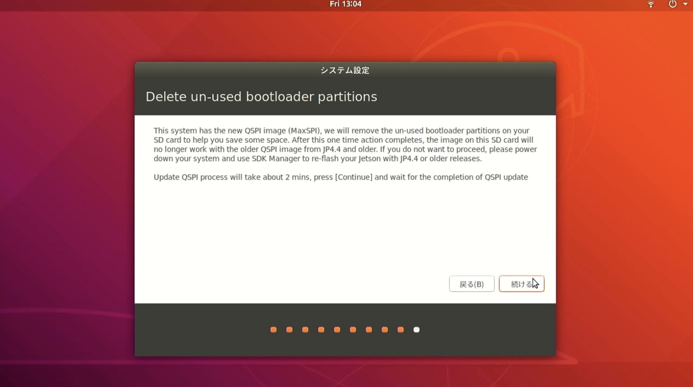

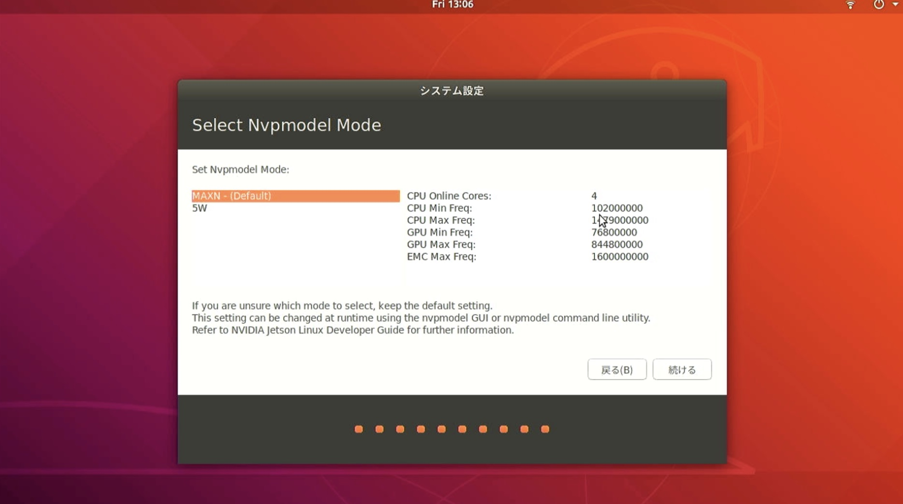

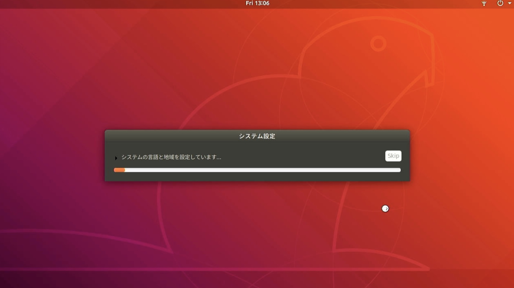

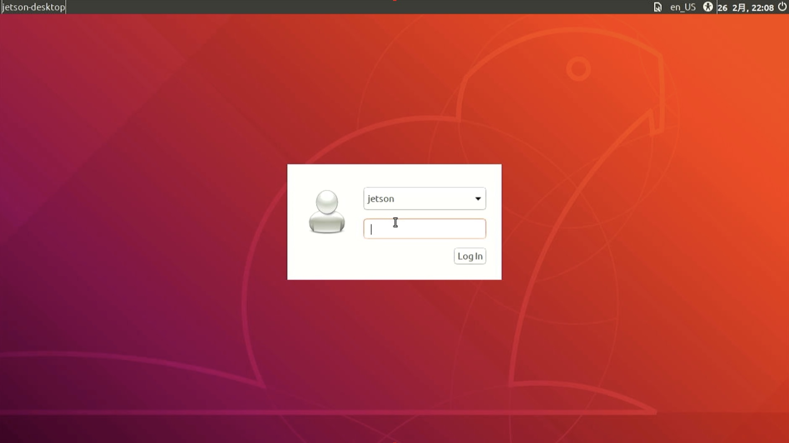

ここまでで設定が完了です。

