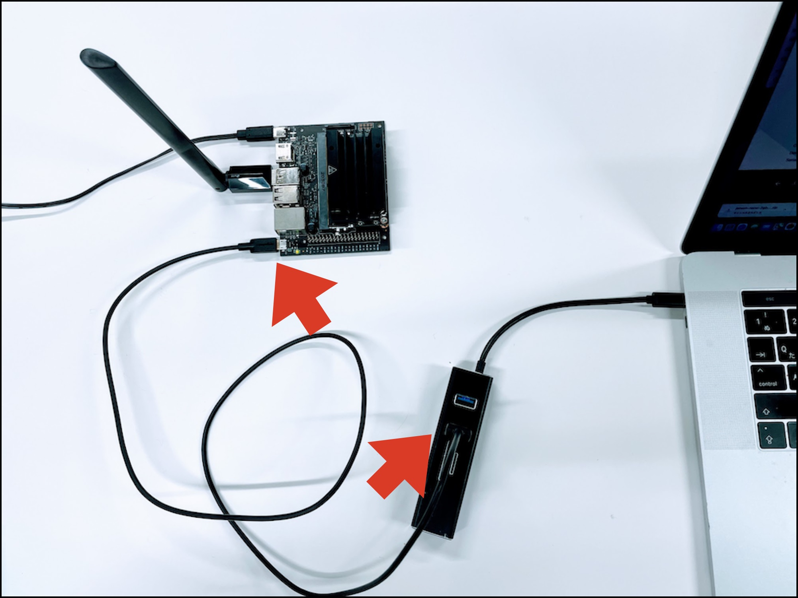
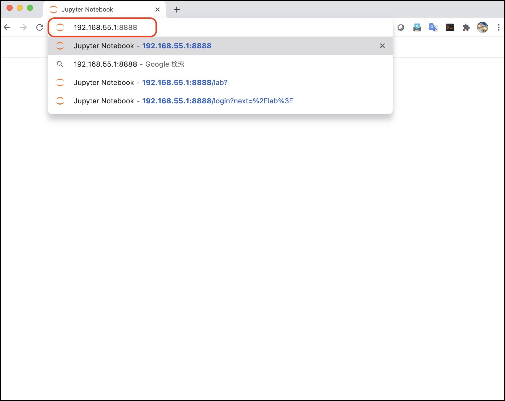
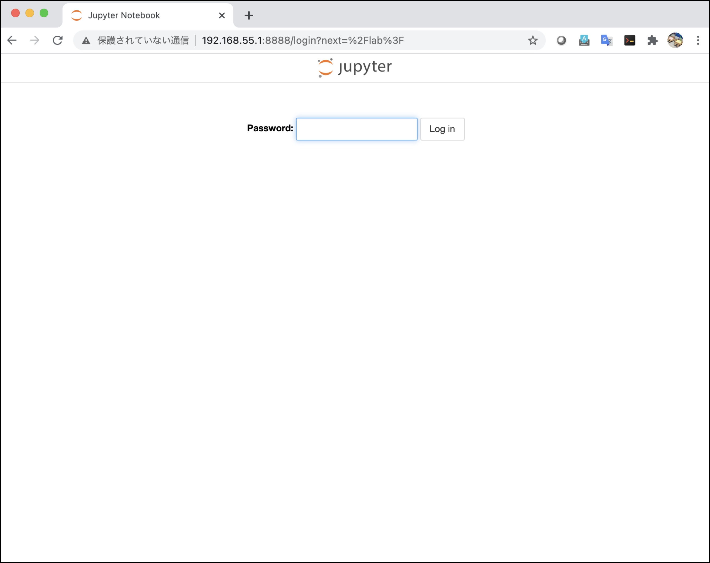
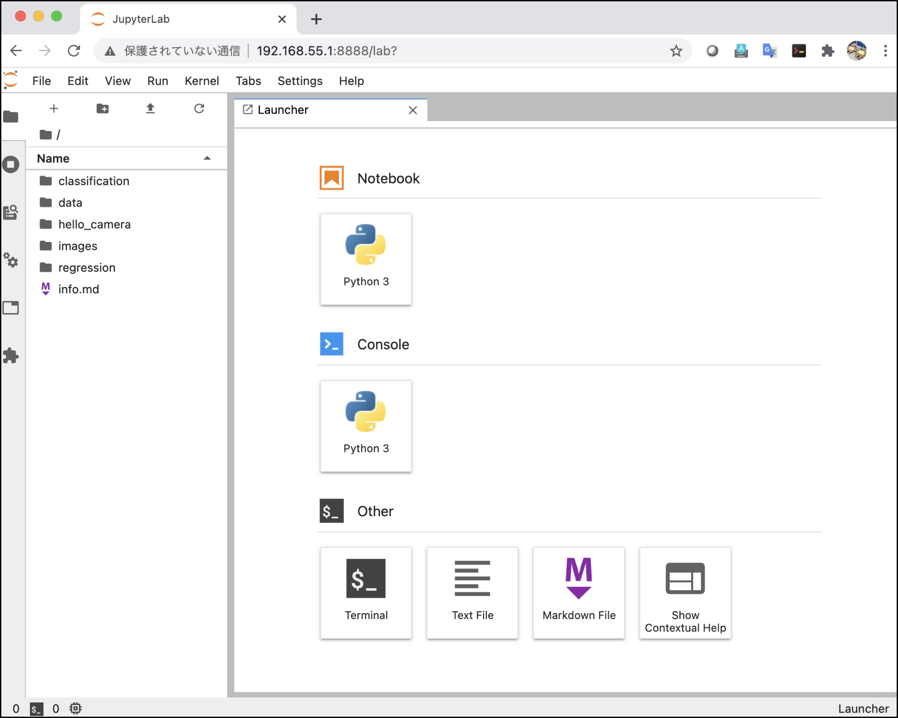

# セットアップ③

## ヘッドレスモードでの接続

Keyboard, Mouse, HDMIを外し、USBでPCと接続します。



`先程設定したユーザ名@192.168.55.1` でPCのターミナルからSSHでログインしてみましょう。

``` shell-session
ssh jetson@192.168.55.1
```

``` shell-session
mkdir -p ~/nvdli-data
```

[NVIDIA NGC](https://ngc.nvidia.com/catalog/containers/nvidia:dli:dli-nano-ai)に公開されている最新のDockerを下記コマンドで、起動します。(下記はJetpack 4.6.1向けの実行コマンド例です)

英語

``` shell-session
sudo docker run --runtime nvidia -itd --restart always --network host \
--volume ~/nvdli-data:/nvdli-nano/data \
--volume /dev/:/dev/ \
--privileged \
--volume /tmp/argus_socket:/tmp/argus_socket \
nvcr.io/nvidia/dli/dli-nano-ai:v2.0.2-r32.7.1
```

日本語

``` shell-session
sudo docker run --runtime nvidia -itd --restart always --network host \
--volume ~/nvdli-data:/nvdli-nano/data \
--volume /dev/:/dev/ \
--privileged \
--volume /tmp/argus_socket:/tmp/argus_socket \
nvcr.io/nvidia/dli/dli-nano-ai:v2.0.2-r32.7.1ja
```


## PCからの接続

Dockerが起動すると、Jetson Nano 2GB上に、JupyterLabが起動します。 Chromeブラウザを起動して、`http://192.168.55.1:8888`に接続します。



JupyterLabが起動するので、Passwordに、`dlinano`と入力します。

|Password|
|:--|
|dlinano|



JupyterLabにログインできれば成功です。



ここまで設定が完了したら、テキストの内容に進みます。


