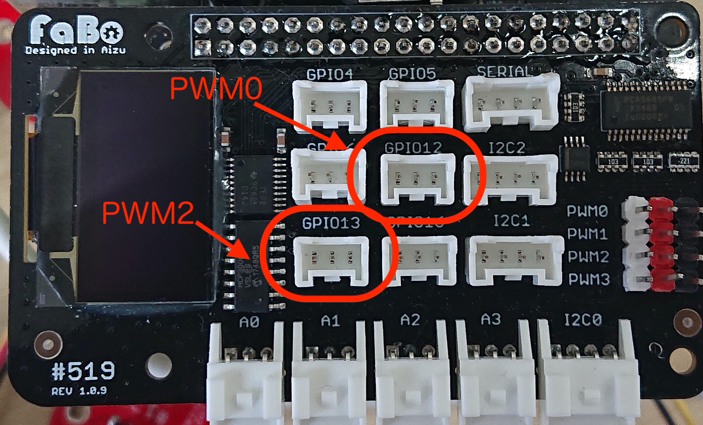

# 102 buzzer


## サンプルコードの動作
JetsonのGPIOからPWM信号を出力し矩形波ドレミの音階を出力します。

## サンプルコード使用時の接続
FaBo #102 buzzerをGPIO12（32pin）,GPIO13(33pin)
)に接続します。



JetsonからPWM信号を出力します。ハードウェアPWM信号でのピンは決まっておりFaBo519の場合は、PWM0とPWM2が利用可能となっており、以下を設定します。

Jupyter labを起動して、＋ボタンをおして、Lancherを起動し、ターミナルを選択します。


以下を入力し
```
＄sudo /opt/nvidia/jetson-io/jetson-io.py
```


Jetson Expansion Header Toolが起動します。


カーソルキー下を押してConfigure 40-pin expansion headerを選んでエンターキーを押します。


有効にしたいピン（pwm０または、pwm２）をカーソルとスペースキーで有効にします。選択が終わったらBack選んでエンターキーを押します。


Exitを選択してエンターキーで終了します。


## JETSON NANO GPIO40ピン
| ピン番号 |  Jetson.GPIO番号  |  NAME  | ピン番号 |  Jetson.GPIO番号  |  NAME  |
| :---: | :---: |---- | :---: | :---: |---- |
|  1  | - |  3.3V  | 2 | - |  5V  |
|  3  | 2 |  I2C_2_SDA  | 4  | - |  5V  |
|  5  | 3 |  I2C_2_SCL  | 6  | - |  GND  |
|  7  | 4 |  AUDIO_MCLK  | 8 | 14 |  UART_2_TX  |
|  9  | - |  GND  | 10  | 15 |  UART_2_RX  |
|  11  | 17 |  UART_2_RTS  | 12  | 18 |  I2S_4_SCLK  |
|  13  | 27 |  SPI_2_SCK  | 14  | - |  GND  |
|  15 | 22 |  LCD_TE  | 16  | 23 |  SPI_2_CS1 |
|  17  | - |  3.3V  | 18  | 24 |  SPI_2_CS0  |
|  19  | 10 |  SPI_1_MOSI  | 20  | - |  GND  |
|  21  | 9 |  SPI_1_MISO  | 22  | 25 |  SPI_2_MISO  |
|  23  | 11 |  SPI_1_SCK  | 24  | 8 |  SPI_1_CS0  |
|  25  | - |  GND  | 26  | 7 |  SPI_1_CS1  |
|  27  | - |  I2C_1_SDA  | 28  | - |  I2C_1_SCL  |
|  29  | 5 |  CAM_AF_EN  | 30  | - |  GND  |
|  31  | 6 |  GPIO_OZ0  | 32  | 12 |  LCD_BL_PWM  |
|  33  | 13 |  GPIO_PE6  | 34  |  - |  GND  |
|  35  | 19 |  I2S_4_LRCK  | 36  | 16 |  UART_2_CTS  |
|  37  | 26 |  SPI_2_MOSI  | 38  | 20 |  I2S_4_SDIN  |
|  39  | - |  GND  | 40  | 21 |  I2S_4_SDOUT  |

<br>

ソースコード
```python

import Jetson.GPIO as GPIO
import time

tempo = 120
onkai = {"C4":261.6, "C4#":277.2, "D4":293.7 ,"D4#":311.1,"E4":329.6,"F4":349.2,"F4#":370.0,"G4":392.0,"G4#":415.3,"A4":440.0,"A4#":466.2,"B4":493.9,"C5":523.3}
notename = ["C4","D4","E4","F4","G4","A4","B4","C5"]
GPIO.setmode(GPIO.BCM)
PIN = 12
GPIO.setup(PIN, GPIO.OUT)
buzzer = GPIO.PWM(PIN, 261.6)
buzzer.start(50)
print ("Play Start.")

for i in notename: 
    freq = onkai[i]
    print (freq)
    buzzer.ChangeFrequency(freq)
    time.sleep(60/tempo)

buzzer.stop()
print ("Play Stop.")
GPIO.cleanup()

```

