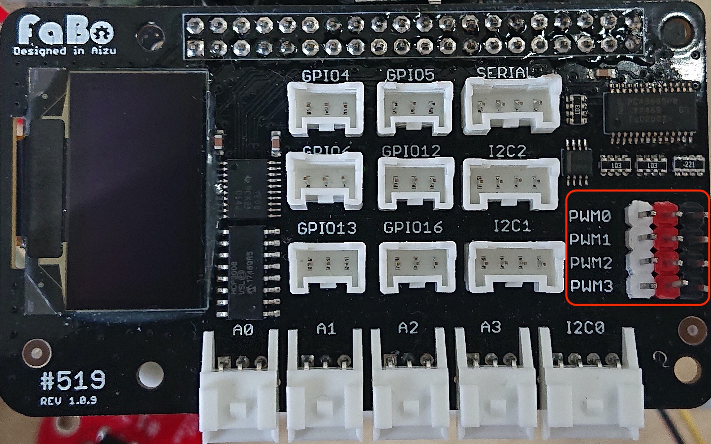

# Servo

＃５１９Jetson OUTINSHEILD搭載PCA9685（LEDドライバ）チップを利用してPWM信号を出力します。PCA9685のI2Cデバイスアドレスは0X60,サーボへのPWM信号周波数は５０Hzで入力します。


サーボの値
付属のサーポの場合、PWMのパルス長が1500u秒（±５u秒）のときは、真ん中に回転し、2000u秒９０度右に回転、1000u秒のときは左に９０度回転したいます。

CW(時計回り)  700uSec~1500uSec

CCW（反時計回り） 1500uSec~2300uSec

## 接続

付属のマイクロサーボFS90RをPWM0に接続します。ストールトルクは 1.3Kgcmとなります。範囲を超えるパルス長、周波数、過剰な負荷は故障の原因となりますのでご注意ください。

PWM0~PWM3




## ライブラリ

smbus2をインストール

```
sudo pip3 install smbus2
```

FaBoPWMをインストール

```
git clone https://github.com/FaBoPlatform/FaBoPWM-PCA9685-Python
cd FaBoPWM-PCA9685-Python
sudo pip3 install .
```

## ソース

初期化

```
# coding: utf-8
import Fabo_PCA9685
import time
import pkg_resources
SMBUS='smbus'
for dist in pkg_resources.working_set:
    #print(dist.project_name, dist.version)
    if dist.project_name == 'smbus':
        break
    if dist.project_name == 'smbus2':
        SMBUS='smbus2'
        break
if SMBUS == 'smbus':
    import smbus
elif SMBUS == 'smbus2':
    import smbus2 as smbus

# init
BUSNUM=1
SERVO_HZ=50
INITIAL_VALUE=300
bus = smbus.SMBus(BUSNUM)
PCA9685 = Fabo_PCA9685.PCA9685(bus,INITIAL_VALUE,address=0x60)
PCA9685.set_hz(SERVO_HZ)
```

値を設定

```
# set value
value = 330
channel = 0 # PWM0番目のピンのサーボ
PCA9685.set_channel_value(channel,value)
```