# ５１９JetsonNano　OUT IN SHEILDの使い方

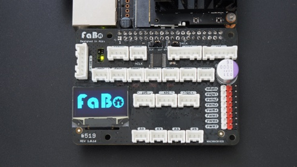

対象基板

|#519 Jetson Nano Revision|
|:--|
|1.0.15|
|1.0.16|

## 電源の停止

Jetson NanoでAIを始めるを無事終了したら、一旦、電源を停止します。

緑色のLEDが消灯したのを確認し、ずれて挿入しないように、基板をJetson４０ピンヘッダーに確実に差し込みます。

念のためUSB type-Cの電源を停止しましょう。（Jetson Nano 2GBの場合）

念のためACアダプタの電源を停止しましょう。（Jetson Nano ４GBの場合）

挿入前

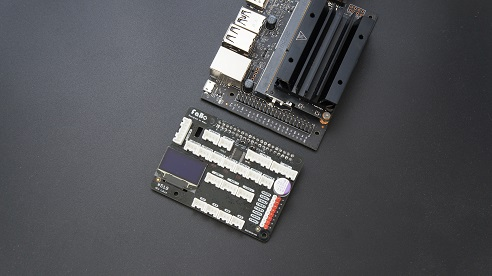

挿入後

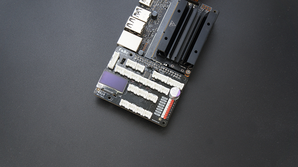

挿入が確認しましたら、電源を再投入してください。

緑色のLEDが点灯します。

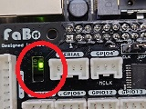

## ジャンパーピンの確認

下の写真のように、デフォルトの状態になるように、ジャンパーピンが以下のようになっているかを確認してください。

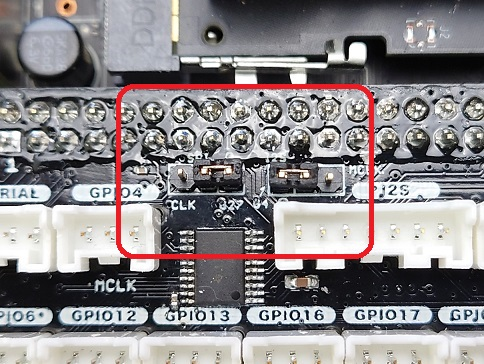

## 内部構造

\#519 ブロック図

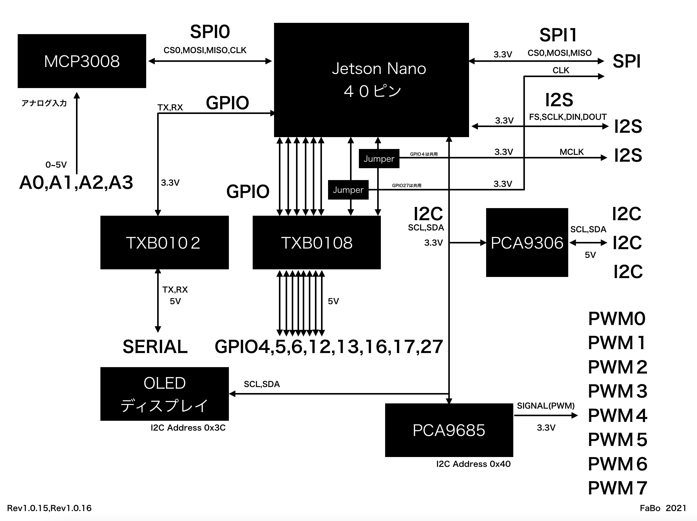

## 各ポート説明

Rev 1.0.15および1.0.16以降

### GPIO

JetsonNanoの４０ピンヘッダーは3.3Vレベルですが、本ボードは、5V電圧に変換しております。

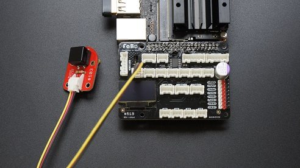

i/o電圧レベルは、５V

|GPIO入出力||
|:--|:--|
|GPIO4|I2S MCLKと兼用|
|GPIO5||
|GPIO6||
|GPIO12|PWM1|
|GPIO13|PWM2|
|GPIO16||
|GPIO17||
|GPIO27|SPI1 CLKと兼用|

合計　８

ピン配列

GPIO配列イラスト挿入予定

※VCCは5.0V~5.4V

### I2C

SCL,SDA信号を3.3Vから５Vへ変換しております。

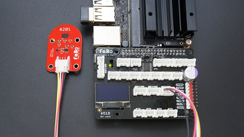

|I2Cポート|
|:--|
|I2C|
|I2C|
|I2C|

合計　３

※バスなので刺す場所を選びません。

※信号レベルは５V

※VCCは5.0V~5.4V

### SERIAL

519ボード内でRX,TX信号を3.3Vから５Vへ変換しております。
主にFaBo#304 USB Serial Brickとの接続を想定しています。

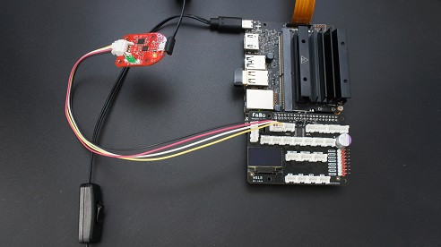

※デフォルトではVCCは出力されません。本ボード裏面にあるジャンパーをはんだでブリッジする必要があります。

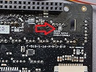

※マイコンなどにつなぐ場合は信号をケーブルをクロスする必要があります。

|UARTポート|
|:--|
|SERIAL|

合計　１

※信号レベルは５V

※VCCは5.0V~5.4V

### ANALOG入力

0V～5V入力の範囲を計測（0~1023）
アナログ計測には、A/Dコンバータ　MCP3008使用しております。

※インターフェースはSPI0を使用

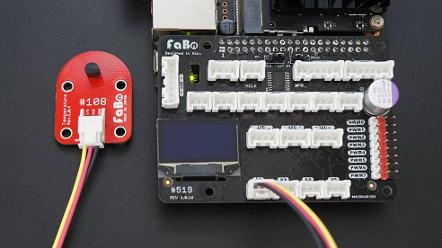

|ANALOGポート|
|:--|
|A0|
|A1|
|A2|
|A3|

合計　４

配列３ピンイラスト挿入予定

VCCピンは５V

### PWM出力

Jetsonからは２つのPWM信号が出力可能となっていますが、本ボードは、より数多くのポートを簡単に使用できるPCA9685を搭載

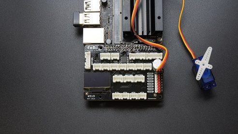

※信号レベルは3.3Vです。

|PWM出力|
|:--|
|PWM0|
|PWM1|
|PWM2|
|PWM3|
|PWM4|
|PWM5|
|PWM6|
|PWM7|

合計　８

電源は、5V~5.4V

※使用するサーボモーター等の消費電力にご注意ください。

ピン配列　３ピン　イラスト挿入予定

※PCA9685のアドレスは基板のレビジョンによって異なりますご注意ください。

|#519アドレス|I２C ADDRESS|
|:--:|:--:|
|Rev1.0.11まで|0x60|
|Rev1.0.12以降|0x40|

### I2S（オプション）
I2Sはマイク、スピーカーデバイスに使われる通信信号です。

|I2Sポート|
|:--|
|I2S|
|I2S|

合計　２

信号レベルは３．３V
VCCピンは５v～５．４Vとなります。

ピン配列　７ピン　イラスト挿入予定

※マスタークロックを使用する場合はジャンパースイッチをGPIO４からMCLK側につなぐ必要があります。

※２０２１年１０月現在　I2S向けBrickは販売しておりません。

### SPI（オプション）

SPI1を使用します。
SPIはI2Cとくらべて高速に通信できます。（メモリ拡張、高速描画な表示器に向きます。）

|SPIポート|
|:--|
|SPI|
|SPI|

合計　１

信号レベルは３．３V
VCCピンは５v～５．４Vとなります。

ピン配列　７ピン　イラスト挿入予定

※SPIを使用する場合はジャンパースイッチをGPIO２７からCLK側につなぐ必要があります。

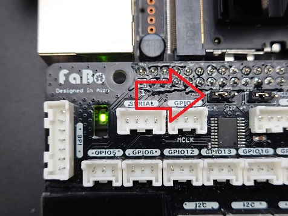

※SPIポートは、FaBoのフルカラーLED（#401,#402,#403）をご使用できます。

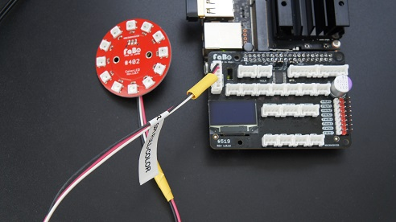

※２０２１年１０月現在　SPI向けBrickは販売しておりません。
