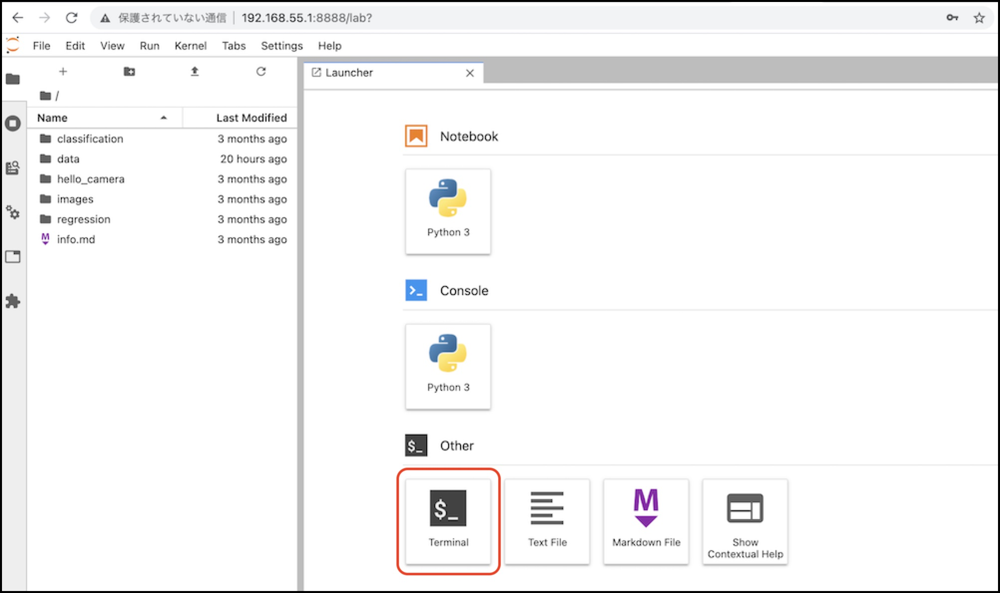
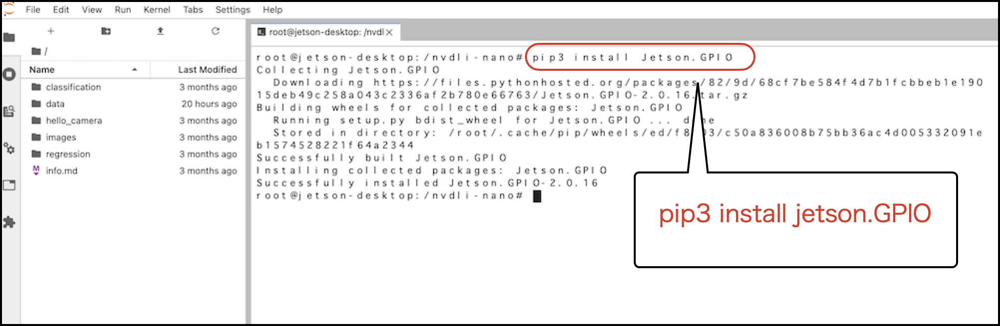

# GPIOの有効化

Jetson NanoでAIを始めるを無事終了したら、再度 Jetson Nanoを再起動します。

## Jetson Nano 2GBへのログイン

```
ssh jetson@192.168.55.1
```

|Password|
|:--|
|jetson|

## Dockerを起動

`--privileged`オプションをつけて、再びDockerを起動します。

```
sudo docker run --runtime nvidia -it --rm --network host \
--volume ~/nvdli-data:/nvdli-nano/data \
--device /dev/video0 \
--privileged \
nvcr.io/nvidia/dli/dli-nano-ai:v2.0.1-r32.6.1
```

## JupyterLabへの接続

`http://192.168.55.1:8888` にChromeで接続し、JupuyterLabに接続します。

|Password|
|:--|
|dlinano|

## GPIOの設定





Jetson.GPIOのインストール

```
pip3 install Jetson.GPIO
```

