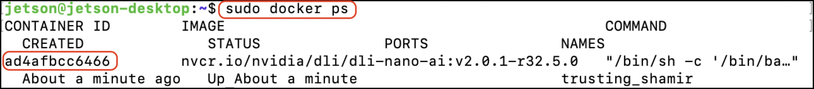

# Dockerの保存

JupyterLab経由ではなく、ssh経由でJetson Nanoにログインします。

```
ssh jetson@192.168.55.1
```

※Docker上でのJupyter labターミナルでは、Dockerの保存はできません。

<br>

DockerのIDを取得します。

```
sudo docker ps
```




Dockerを`handson`という名称で、commitします。

```
sudo docker commit ID(現在起動中のもの)  handson
```

現在起動中のDockerを停止します。

```
sudo docker stop ID(現在起動中のもの)
```

CommitしたDockerの起動

```
sudo docker run --runtime nvidia -it --network host \
--volume ~/nvdli-data:/nvdli-nano/data \
--device /dev/video0 \
--privileged \
handson
```

