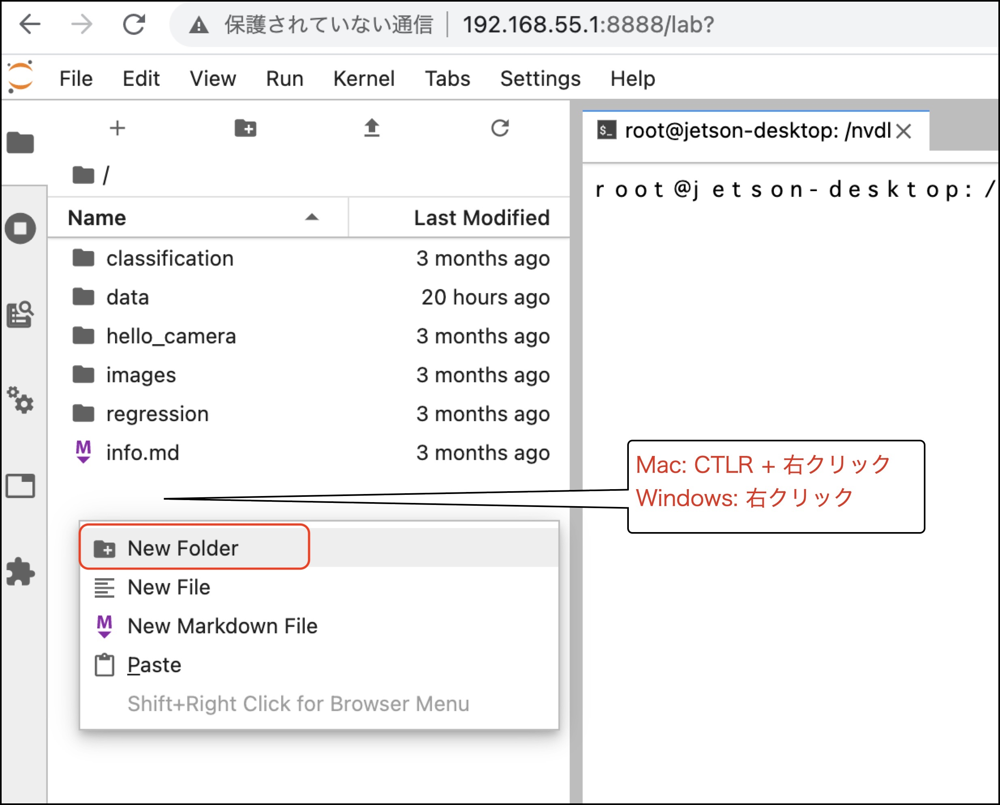
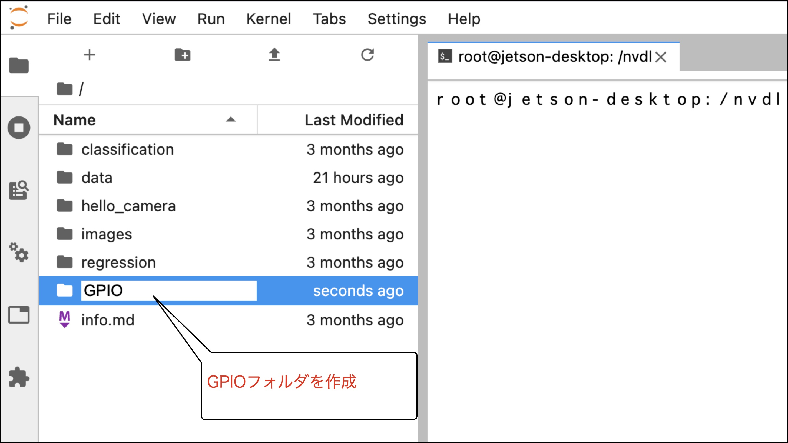
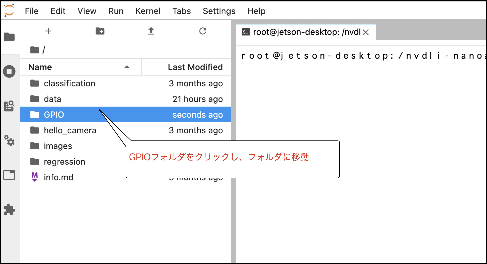
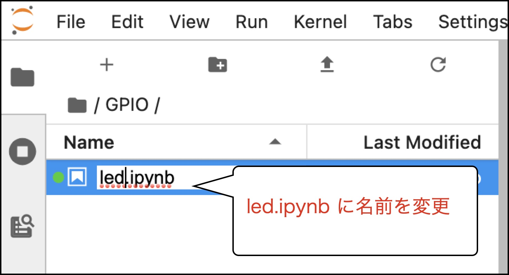
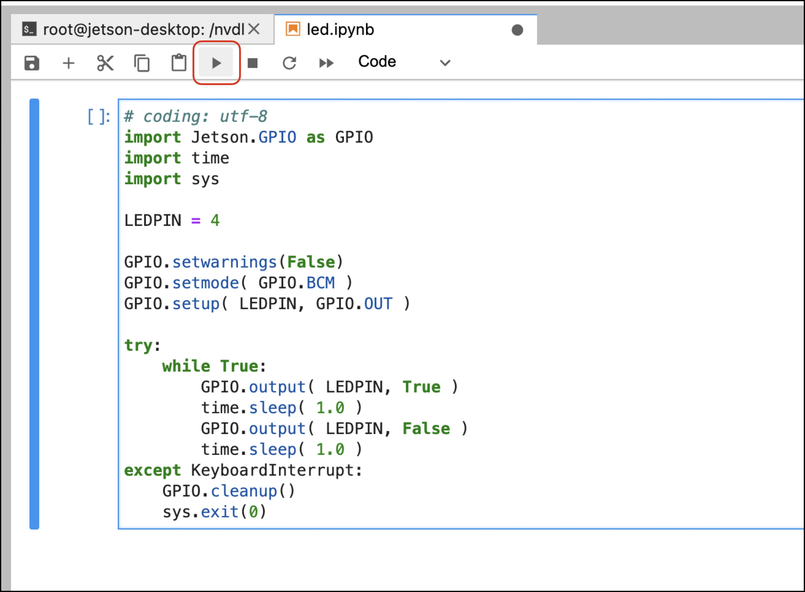

# LED

LED(101)、LED2(128)を使用してLEDの点滅表示のサンプルを作成します。

## Notebookの新規作成

これから、GPIOというフォルダを作り、led.ipynbというPython3で動くファイルを作成します。
右クリック、New Folderを選択します。



GPIOを入力します。



GPIOフォルダの中へ移動します。



ファイルの新規作成します。


Python3のファイルを作成します。Python3アイコンをクリックします。


Untitled.ipynbというファイルができます。


ファイル名上で右クリックして、Renameを選択します。


led.ipynbと入力します。



## LEDの点滅

LED Brick(#101,#128)をGPIO4に接続し、下のサンプルコードをコピーして貼り付けます。その次に、以下の示す▶︎ボタンをクリックしてコードを実行します。



LED点滅のサンプルコード

``` python
# coding: utf-8
import Jetson.GPIO as GPIO
import time
import sys

LEDPIN = 4

GPIO.setwarnings(False)
GPIO.setmode( GPIO.BCM )
GPIO.setup( LEDPIN, GPIO.OUT )

try:
    while True:
        GPIO.output( LEDPIN, True )
        time.sleep( 1.0 )
        GPIO.output( LEDPIN, False )
        time.sleep( 1.0 ) 
except KeyboardInterrupt:
    GPIO.cleanup()
    sys.exit(0)
```

停止は■をクリックします。


