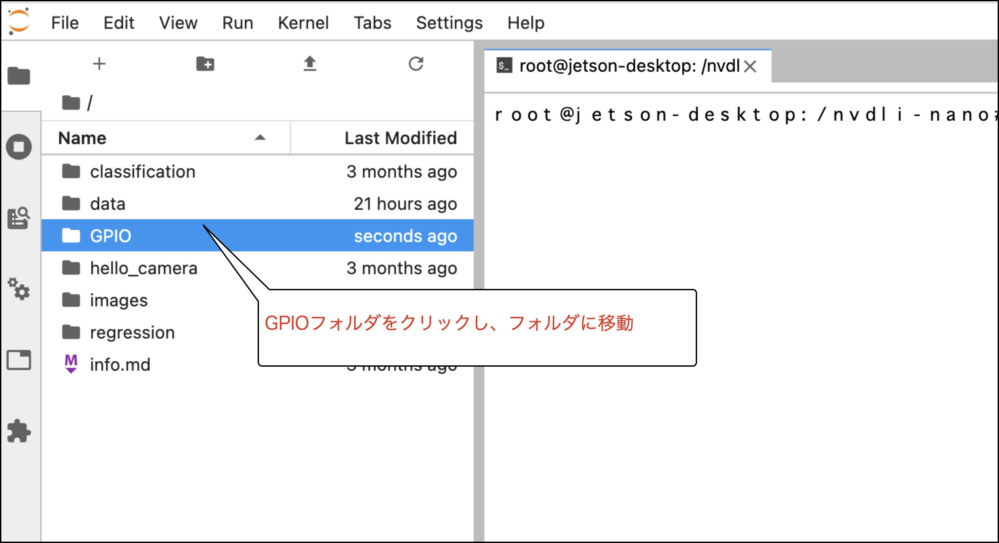
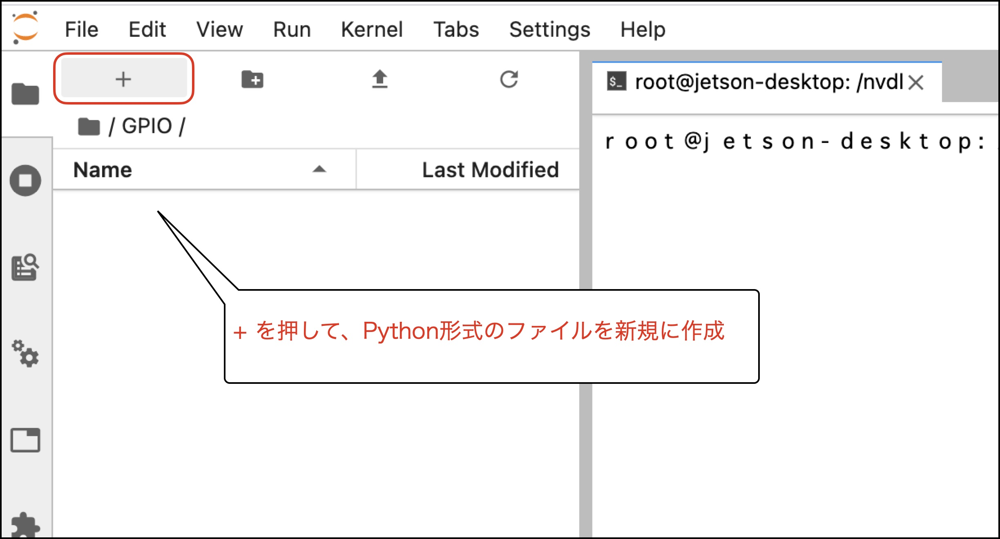
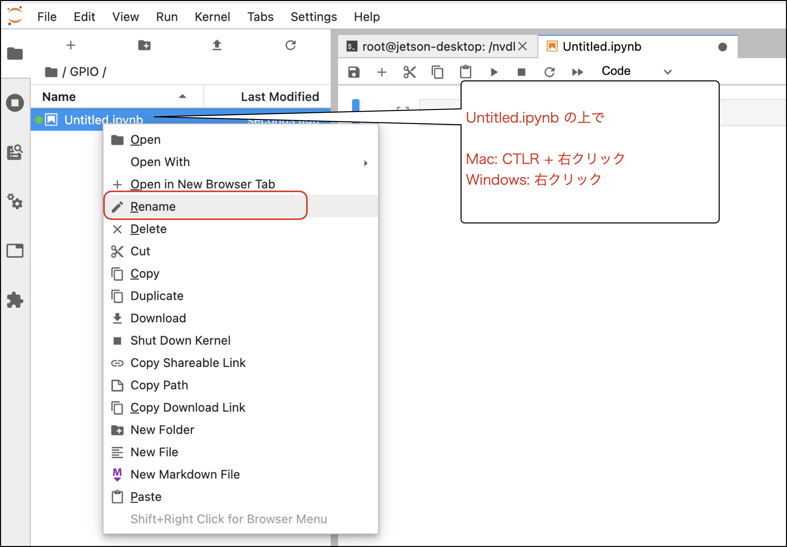
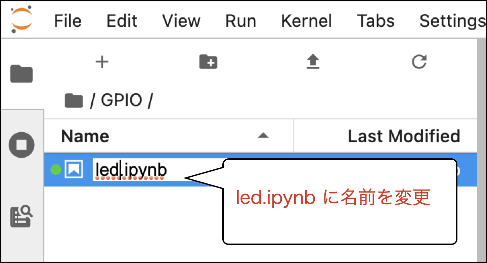
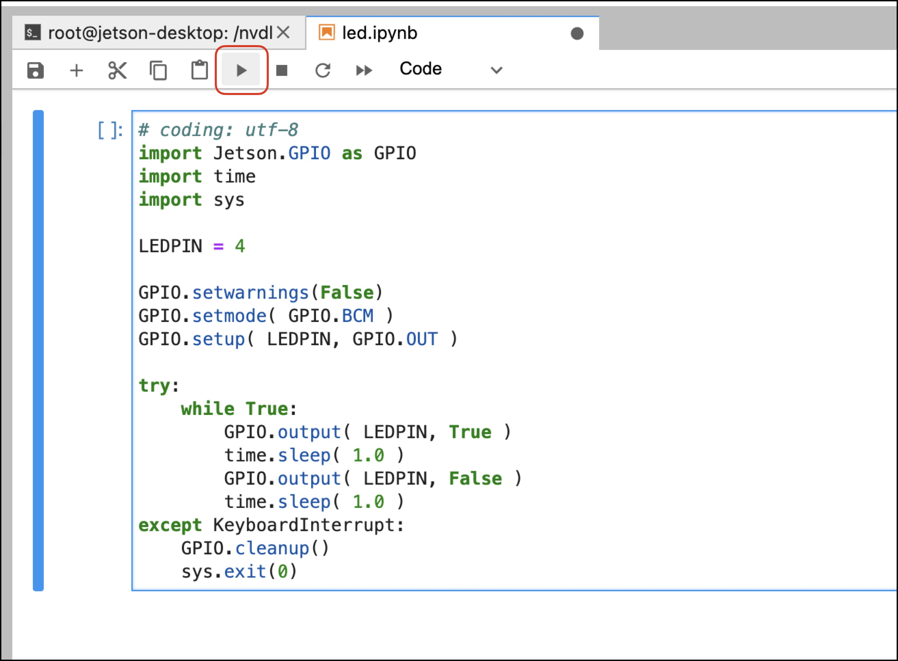

# LED

LED(101)、LED2(128)を使用してLEDの点滅表示のサンプルを作成します。

## Notebookの新規作成











## LEDの点滅

LEDをGPIO4に接続します。



``` python
# coding: utf-8
import Jetson.GPIO as GPIO
import time
import sys

LEDPIN = 4

GPIO.setwarnings(False)
GPIO.setmode( GPIO.BCM )
GPIO.setup( LEDPIN, GPIO.OUT )

try:
    while True:
        GPIO.output( LEDPIN, True )
        time.sleep( 1.0 )
        GPIO.output( LEDPIN, False )
        time.sleep( 1.0 ) 
except KeyboardInterrupt:
    GPIO.cleanup()
    sys.exit(0)
```

停止は■をおします。


