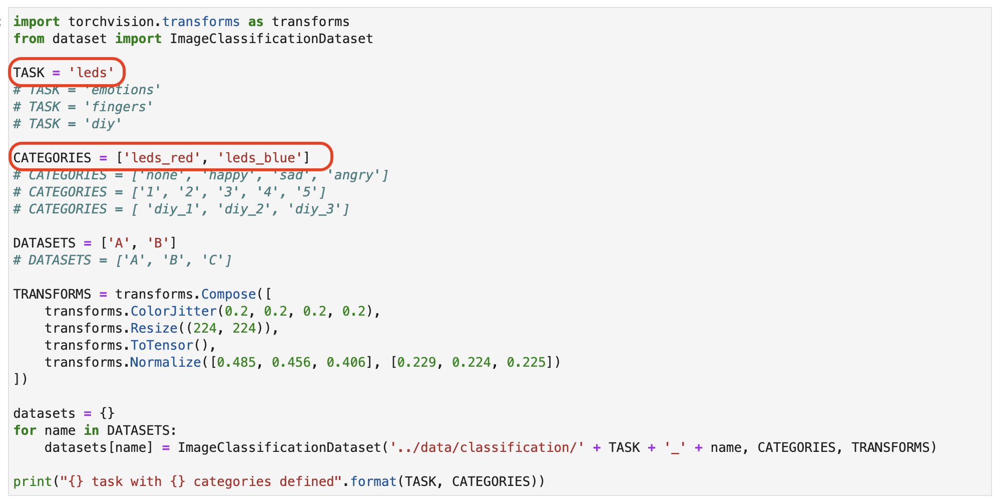
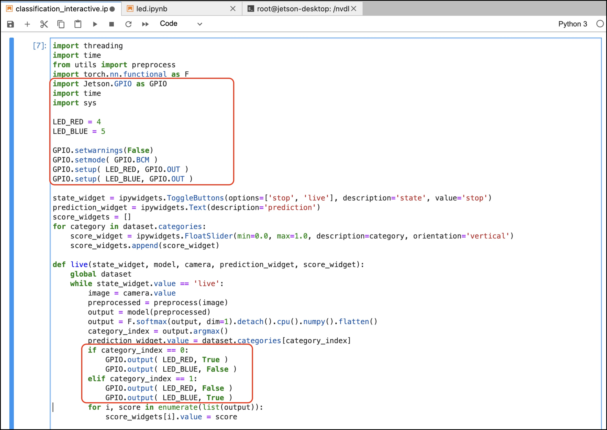

# AIとの連携

## サンプルのコピー

Terminalで下記コマンドで、classificationのサンプルをGPIO以下にコピーします。

```
cp /nvdli-nano/classification/* /nvdli-nano/GPIO/
```

## LED部分の追加

LEDとの連携は、下記部分にソースを追加します。





```
import torchvision.transforms as transforms
from dataset import ImageClassificationDataset

TASK = 'leds'
# TASK = 'emotions'
# TASK = 'fingers'
# TASK = 'diy'

CATEGORIES = ['leds_red', 'leds_blue']
# CATEGORIES = ['none', 'happy', 'sad', 'angry']
# CATEGORIES = ['1', '2', '3', '4', '5']
# CATEGORIES = [ 'diy_1', 'diy_2', 'diy_3']

DATASETS = ['A', 'B']
# DATASETS = ['A', 'B', 'C']
```

```
import threading
import time
from utils import preprocess
import torch.nn.functional as F
import Jetson.GPIO as GPIO
import time
import sys

LED_RED = 4
LED_BLUE = 5

GPIO.setwarnings(False)
GPIO.setmode( GPIO.BCM )
GPIO.setup( LED_RED, GPIO.OUT )
GPIO.setup( LED_BLUE, GPIO.OUT )
```

```
def live(state_widget, model, camera, prediction_widget, score_widget):
    global dataset
    while state_widget.value == 'live':
        image = camera.value
        preprocessed = preprocess(image)
        output = model(preprocessed)
        output = F.softmax(output, dim=1).detach().cpu().numpy().flatten()
        category_index = output.argmax()
        prediction_widget.value = dataset.categories[category_index]
        if category_index == 0:
            GPIO.output( LED_RED, True )
            GPIO.output( LED_BLUE, False )
        elif category_index == 1:
            GPIO.output( LED_RED, False )
            GPIO.output( LED_BLUE, True )
        for i, score in enumerate(list(output)):
            score_widgets[i].value = score
```

