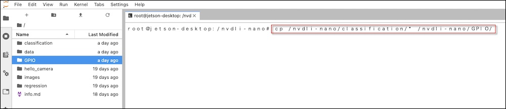
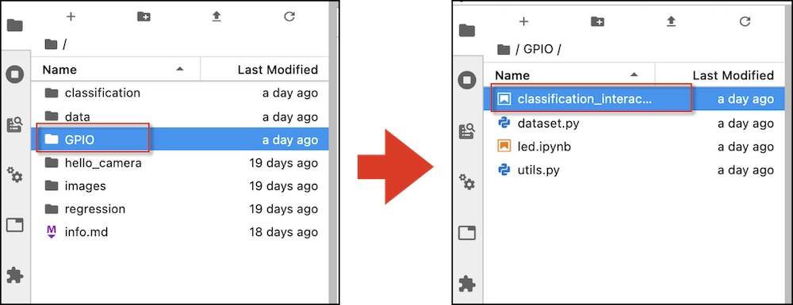
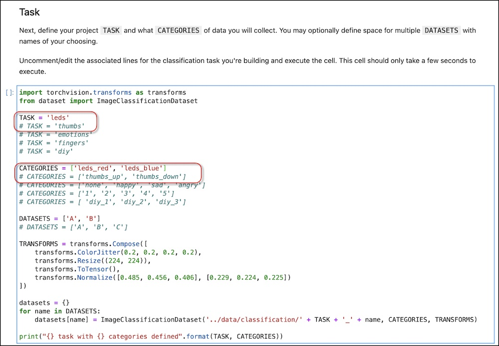
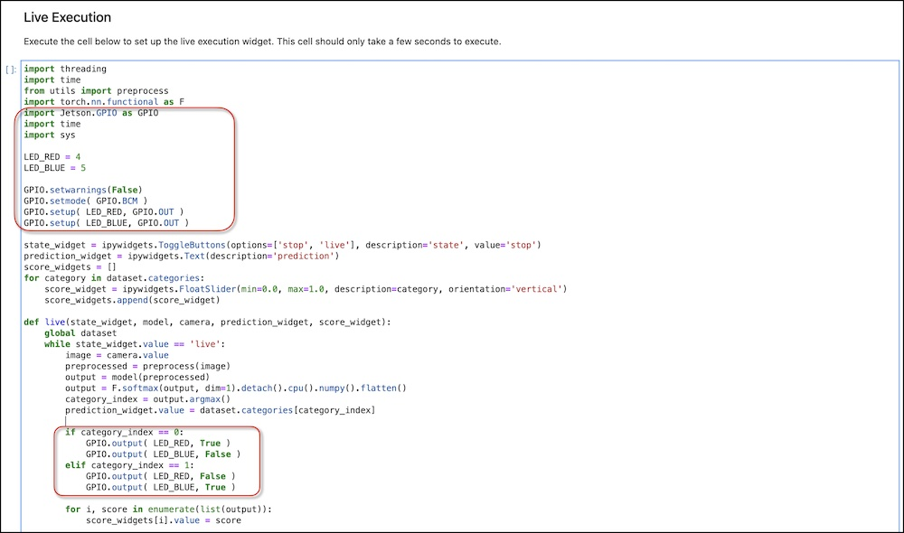

# AIとの連携

付属のUSBカメラで画像を作成し、分類の教師データを与え、Jetson Nanoに学習、その結果をLEDで表します。

USBカメラを接続しましょう。

## サンプルのコピー

Terminalで下記コマンドで、classificationのサンプルをGPIO以下にコピーします。



```
cp -r /nvdli-nano/classification/* /nvdli-nano/GPIO/
```



## LED部分の追加

LEDとの連携は、`classification_interactive.ipynb`に下記部分を追加します。

追加するコードの場所を確認します。



黄色い領域のコードを追加、変更します。

``` python hl_lines="4 5 10 11"
import torchvision.transforms as transforms
from dataset import ImageClassificationDataset

TASK = 'leds'
# TASK = 'thumbs'
# TASK = 'emotions'
# TASK = 'fingers'
# TASK = 'diy'

CATEGORIES = ['leds_red', 'leds_blue']
# CATEGORIES = ['thumbs_up', 'thumbs_down']
# CATEGORIES = ['none', 'happy', 'sad', 'angry']
# CATEGORIES = ['1', '2', '3', '4', '5']
# CATEGORIES = [ 'diy_1', 'diy_2', 'diy_3']

DATASETS = ['A', 'B']
# DATASETS = ['A', 'B', 'C']

TRANSFORMS = transforms.Compose([
    transforms.ColorJitter(0.2, 0.2, 0.2, 0.2),
    transforms.Resize((224, 224)),
    transforms.ToTensor(),
    transforms.Normalize([0.485, 0.456, 0.406], [0.229, 0.224, 0.225])
])

datasets = {}
for name in DATASETS:
    datasets[name] = ImageClassificationDataset('../data/classification/' + TASK + '_' + name, CATEGORIES, TRANSFORMS)

print("{} task with {} categories defined".format(TASK, CATEGORIES))
```

追加するコードの場所を確認します。



追加するコードの場所を確認します。

``` python hl_lines="5 6 7 8 9 10 11 12 13 14 15 34 35 36 37 38 39"
import threading
import time
from utils import preprocess
import torch.nn.functional as F
import Jetson.GPIO as GPIO
import time
import sys

LED_RED = 4
LED_BLUE = 5

GPIO.setwarnings(False)
GPIO.setmode( GPIO.BCM )
GPIO.setup( LED_RED, GPIO.OUT )
GPIO.setup( LED_BLUE, GPIO.OUT )

state_widget = ipywidgets.ToggleButtons(options=['stop', 'live'], description='state', value='stop')
prediction_widget = ipywidgets.Text(description='prediction')
score_widgets = []
for category in dataset.categories:
    score_widget = ipywidgets.FloatSlider(min=0.0, max=1.0, description=category, orientation='vertical')
    score_widgets.append(score_widget)

def live(state_widget, model, camera, prediction_widget, score_widget):
    global dataset
    while state_widget.value == 'live':
        image = camera.value
        preprocessed = preprocess(image)
        output = model(preprocessed)
        output = F.softmax(output, dim=1).detach().cpu().numpy().flatten()
        category_index = output.argmax()
        prediction_widget.value = dataset.categories[category_index]

        if category_index == 0:
            GPIO.output( LED_RED, True )
            GPIO.output( LED_BLUE, False )
        elif category_index == 1:
            GPIO.output( LED_RED, False )
            GPIO.output( LED_BLUE, True )

        for i, score in enumerate(list(output)):
            score_widgets[i].value = score

def start_live(change):
    if change['new'] == 'live':
        execute_thread = threading.Thread(target=live, args=(state_widget, model, camera, prediction_widget, score_widget))
        execute_thread.start()

state_widget.observe(start_live, names='value')

live_execution_widget = ipywidgets.VBox([
    ipywidgets.HBox(score_widgets),
    prediction_widget,
    state_widget
])

# display(live_execution_widget)
print("live_execution_widget created")
```

led_red,led_blueをカテゴリーで選択し、Addボタンを押して、カメラ画像データセット収集後

学習(train)ボタンをクリックし、モデルができたならば保存しましょう。

動作が確認できたなら、つぎのページでDockerでの保存しましょう。
