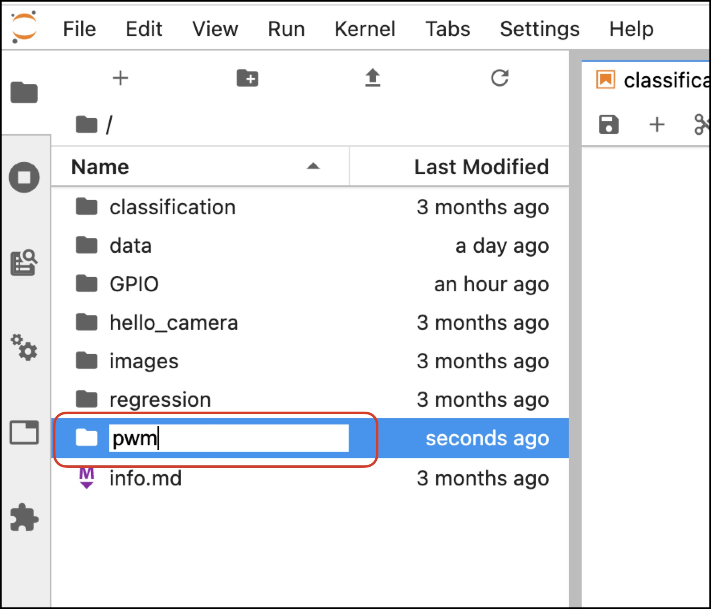

# PWMの設定

＃５１９Jetson OUTINSHEILD搭載PCA9685（LEDドライバ）チップを利用してPWM信号を出力します。PCA9685のI2Cデバイスアドレスは0X60,サーボへのPWM信号周波数は５０Hzで入力します。


## Jetson Nano 2GBへのログイン

```
ssh jetson@192.168.55.1
```

|Password|
|:--|
|jetson|

## Dockerを起動

下記コマンドでDockerを起動します。

```
sudo docker run --runtime nvidia -it --network host \
--volume ~/nvdli-data:/nvdli-nano/data \
--device /dev/video0 \
--privileged \
handson
```

## JupyterLabへの接続

Chromeブラウザを起動し、`http://192.168.55.1:8888` にアクセスし、JupuyterLabに接続します。

|Password|
|:--|
|dlinano|

## ライブラリ

JupyterLab上でTerminalを起動して、PWM関連の制御に必要なライブラリをインストールします。

smbusをインストール

```
apt install python-smbus
```

FaBoPWMをインストール

```
cd ~
git clone https://github.com/FaBoPlatform/FaBoPWM-PCA9685-Python
cd FaBoPWM-PCA9685-Python
pip3 install .
```

```
pip3 install smbus
```

## pwmフォルダの作成

