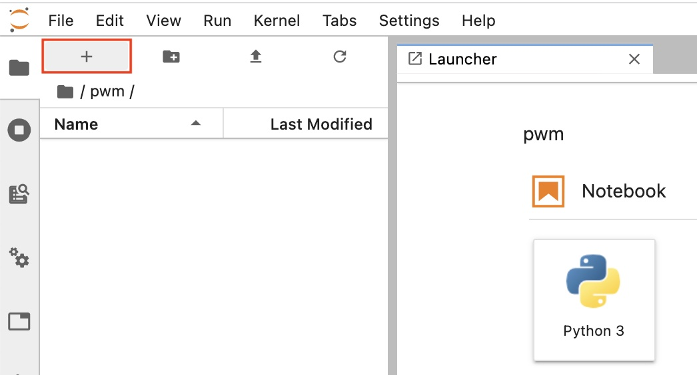
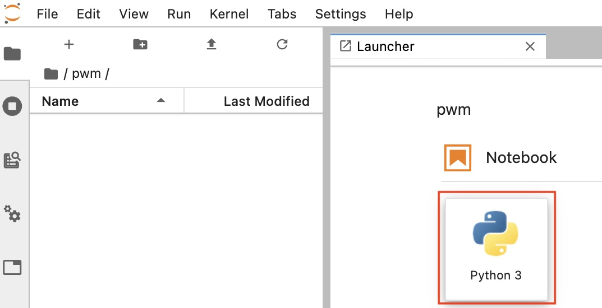
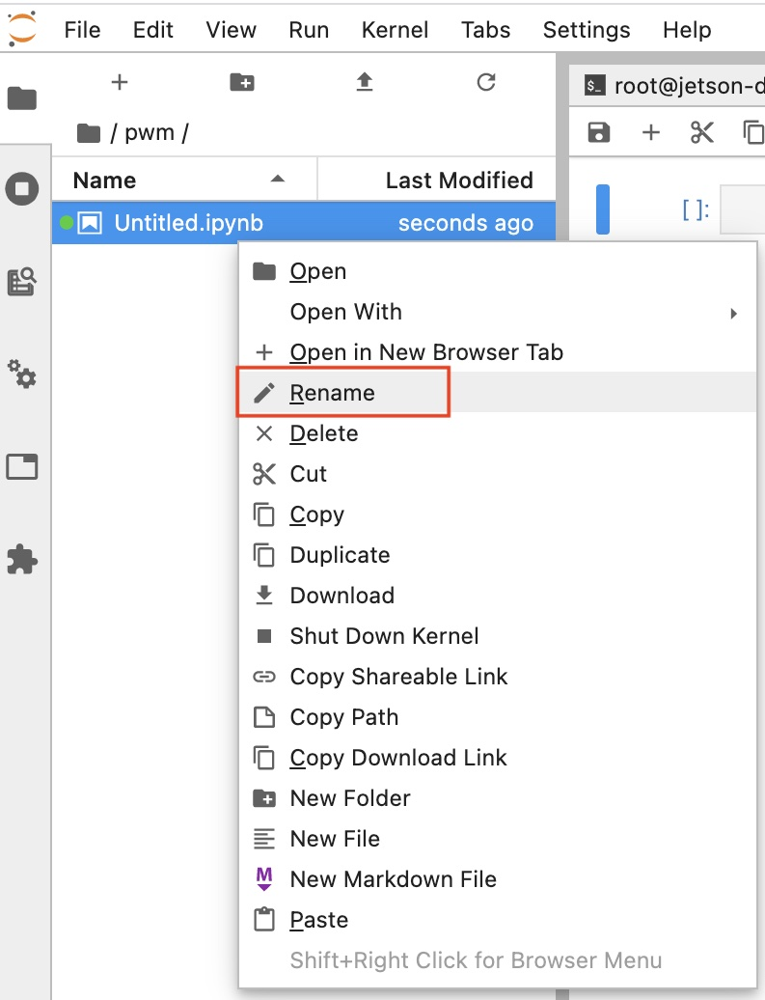
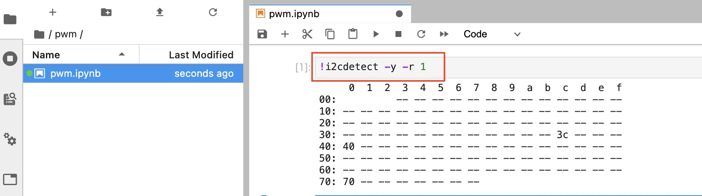
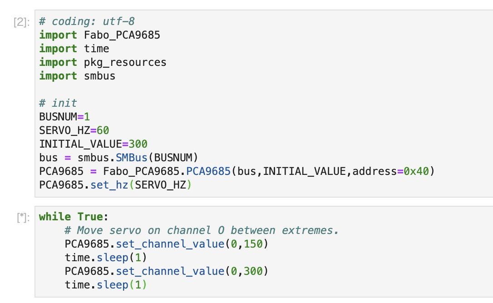

# Servoの制御







## PWM用チップの認識



```
!i2cdetect -y -r 1
```

`0x40`がPCA9685のアドレス番号になっています。

## PWMサーボの制御



初期化

``` python
# coding: utf-8
import Fabo_PCA9685
import time
import pkg_resources
import smbus

# init
BUSNUM=1
SERVO_HZ=60
INITIAL_VALUE=300
bus = smbus.SMBus(BUSNUM)
PCA9685 = Fabo_PCA9685.PCA9685(bus,INITIAL_VALUE,address=0x40)
PCA9685.set_hz(SERVO_HZ)
```

値を設定

``` python
while True:
    # Move servo on channel O between extremes.
    PCA9685.set_channel_value(0,150)
    time.sleep(1)
    PCA9685.set_channel_value(0,300)
    time.sleep(1)
```

