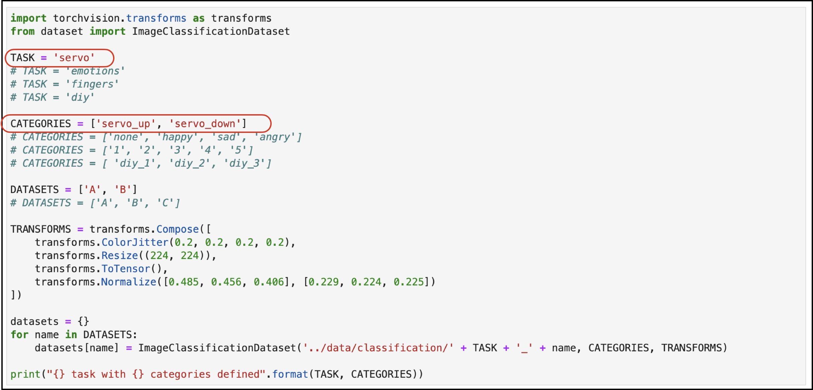
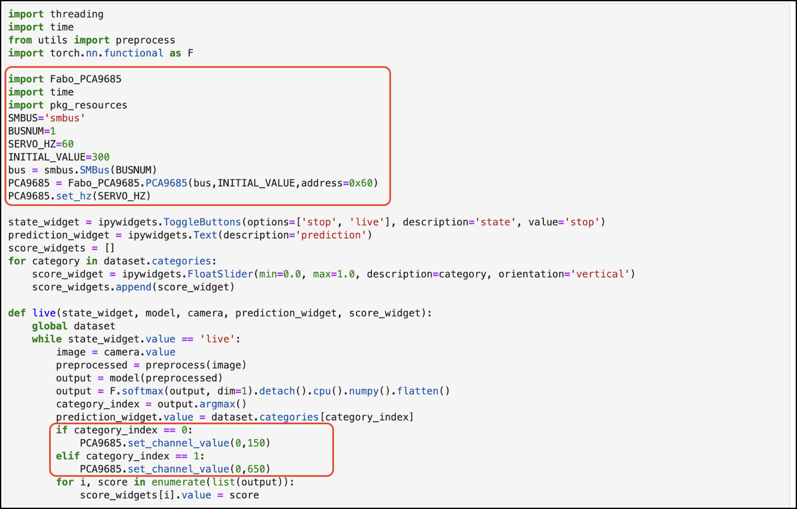

# ServoとAIの連携(分類)

## サンプルのコピー

JupyterLabのTerminalを起動し、下記コマンドを使用し、classificationのサンプルをpwmフォルダ以下にコピーします。

```
cp -r /nvdli-nano/classification/* /nvdli-nano/pwm/
```

## ソースの修正

以下の黄色い領域のコードを追加します。

``` python hl_lines="4 5 10 11"
import torchvision.transforms as transforms
from dataset import ImageClassificationDataset

TASK = 'servo'
# TASK = 'thumbs'
# TASK = 'emotions'
# TASK = 'fingers'
# TASK = 'diy'

CATEGORIES = ['servo_left', 'servo_right']
# CATEGORIES = ['thumbs_up', 'thumbs_down']
# CATEGORIES = ['none', 'happy', 'sad', 'angry']
# CATEGORIES = ['1', '2', '3', '4', '5']
# CATEGORIES = [ 'diy_1', 'diy_2', 'diy_3']

DATASETS = ['A', 'B']
# DATASETS = ['A', 'B', 'C']

TRANSFORMS = transforms.Compose([
    transforms.ColorJitter(0.2, 0.2, 0.2, 0.2),
    transforms.Resize((224, 224)),
    transforms.ToTensor(),
    transforms.Normalize([0.485, 0.456, 0.406], [0.229, 0.224, 0.225])
])

datasets = {}
for name in DATASETS:
    datasets[name] = ImageClassificationDataset('../data/classification/' + TASK + '_' + name, CATEGORIES, TRANSFORMS)
    
print("{} task with {} categories defined".format(TASK, CATEGORIES))
```

コードを追加する場所を確認します。



コードを追加する場所を確認します。



以下の黄色い領域のコードを追加します。

``` python hl_lines="6 7 8 9 10 11 12 13 14 15 16 17 36 37 38 39"
import threading
import time
from utils import preprocess
import torch.nn.functional as F

import Fabo_PCA9685
import time
import pkg_resources
import smbus

SMBUS='smbus'
BUSNUM=1
SERVO_HZ=60
INITIAL_VALUE=300
bus = smbus.SMBus(BUSNUM)
PCA9685 = Fabo_PCA9685.PCA9685(bus,INITIAL_VALUE,address=0x40)
PCA9685.set_hz(SERVO_HZ)

state_widget = ipywidgets.ToggleButtons(options=['stop', 'live'], description='state', value='stop')
prediction_widget = ipywidgets.Text(description='prediction')
score_widgets = []
for category in dataset.categories:
    score_widget = ipywidgets.FloatSlider(min=0.0, max=1.0, description=category, orientation='vertical')
    score_widgets.append(score_widget)

def live(state_widget, model, camera, prediction_widget, score_widget):
    global dataset
    while state_widget.value == 'live':
        image = camera.value
        preprocessed = preprocess(image)
        output = model(preprocessed)
        output = F.softmax(output, dim=1).detach().cpu().numpy().flatten()
        category_index = output.argmax()
        prediction_widget.value = dataset.categories[category_index]
        
        if category_index == 0:
            PCA9685.set_channel_value(0,150)
        elif category_index == 1:
            PCA9685.set_channel_value(0,650)

        for i, score in enumerate(list(output)):
            score_widgets[i].value = score
```