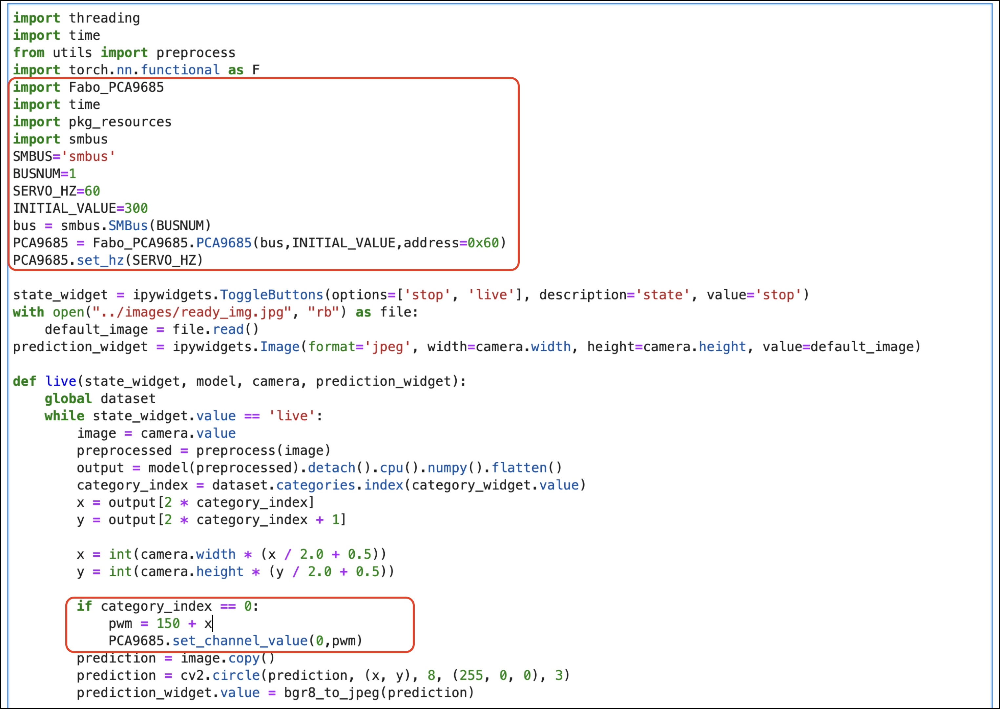

# ServoとAIの連携(回帰)

## ソースの修正




```
import threading
import time
from utils import preprocess
import torch.nn.functional as F
import Fabo_PCA9685
import time
import pkg_resources
import smbus
SMBUS='smbus'
BUSNUM=1
SERVO_HZ=60
INITIAL_VALUE=300
bus = smbus.SMBus(BUSNUM)
PCA9685 = Fabo_PCA9685.PCA9685(bus,INITIAL_VALUE,address=0x60)
PCA9685.set_hz(SERVO_HZ)

state_widget = ipywidgets.ToggleButtons(options=['stop', 'live'], description='state', value='stop')
with open("../images/ready_img.jpg", "rb") as file:
    default_image = file.read()
prediction_widget = ipywidgets.Image(format='jpeg', width=camera.width, height=camera.height, value=default_image)

def live(state_widget, model, camera, prediction_widget):
    global dataset
    while state_widget.value == 'live':
        image = camera.value
        preprocessed = preprocess(image)
        output = model(preprocessed).detach().cpu().numpy().flatten()
        category_index = dataset.categories.index(category_widget.value)
        x = output[2 * category_index]
        y = output[2 * category_index + 1]
        
        x = int(camera.width * (x / 2.0 + 0.5))
        y = int(camera.height * (y / 2.0 + 0.5))
        
        if category_index == 0:
            pwm = 150 + x
            PCA9685.set_channel_value(0,pwm)
        prediction = image.copy()
        prediction = cv2.circle(prediction, (x, y), 8, (255, 0, 0), 3)
        prediction_widget.value = bgr8_to_jpeg(prediction)
            
def start_live(change):
    if change['new'] == 'live':
        execute_thread = threading.Thread(target=live, args=(state_widget, model, camera, prediction_widget))
        execute_thread.start()

state_widget.observe(start_live, names='value')

live_execution_widget = ipywidgets.VBox([
    prediction_widget,
    state_widget
])

# display(live_execution_widget)
print("live_execution_widget created")
```