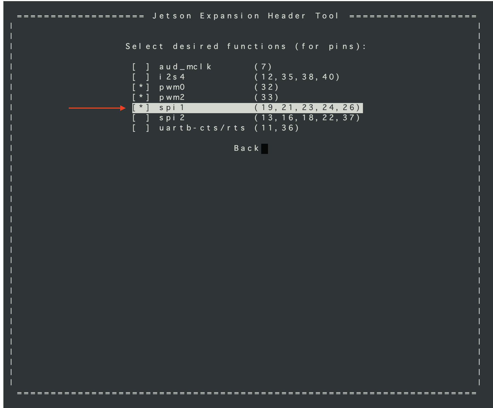
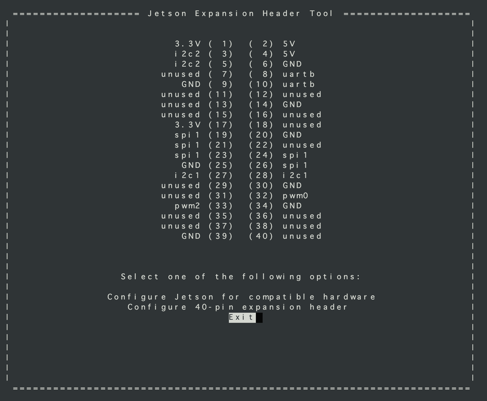

# SPIの設定

## SPIの有効化

FaBo 519 OutinSheildのアナログ計測はMCP3008を使用します。このMCP3008は、SPI1を使いますので、GPIOからSPI1のポートへ設定します。

Jestonに、PCから直接SSHでログインし、Dockerを起動しているUbuntu自体の修正を実施します。

Jetson-IO toolを起動します。

```
$sudo /opt/nvidia/jetson-io/jetson-io.py
```

Jetson　Expansion Header Toolが起動します。


カーソルとスペースキーでSPI１を有効にします。




カーソルでEXITに合わせてエンターキーを押します。
　



カスタムDTBが作成されSPIがつかえるようになります。


再起動されます。

※注意　JetPack4.6をお使いの方はDockerを起動する前に、


## 再起動時にSPIを有効にする

/etc/modules-load.d/modules.conf

```
spidev
```

を追記すると再起動時にspidevが呼び込まれます。
