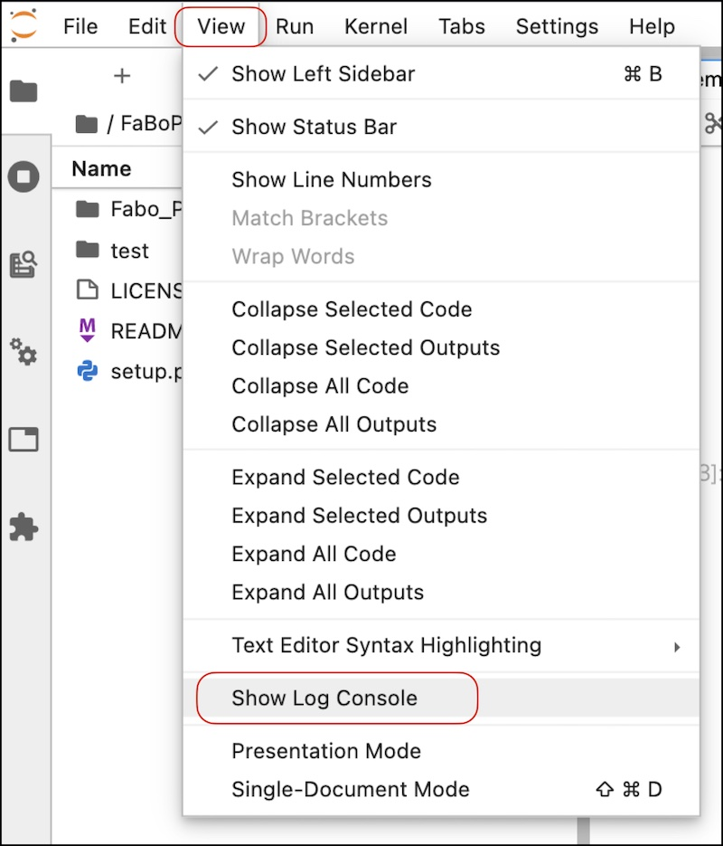
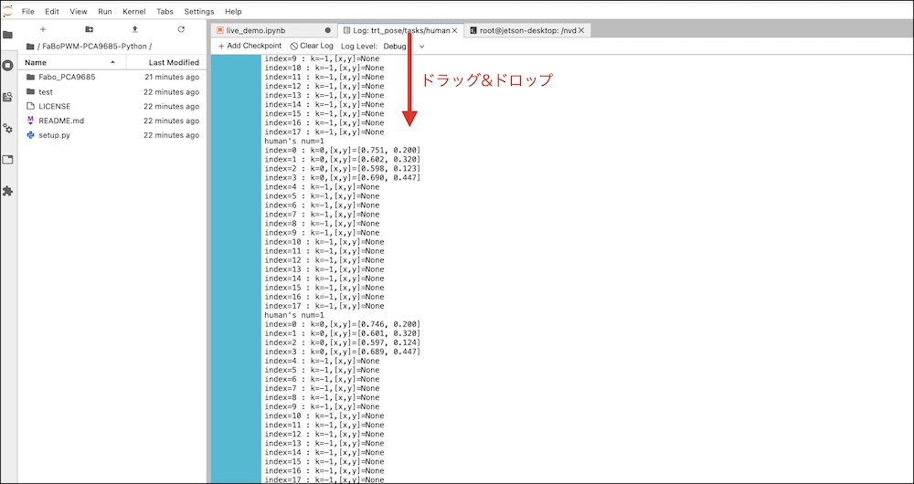
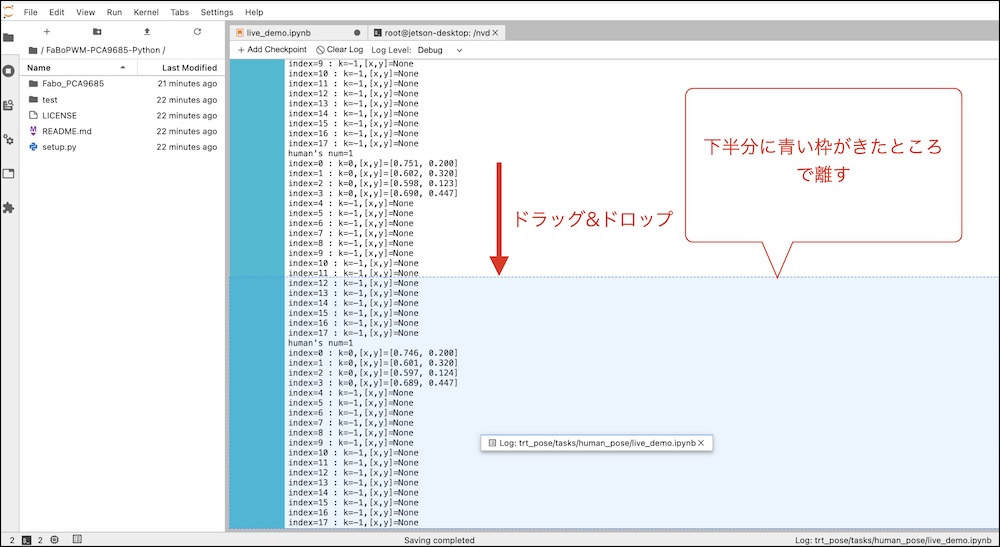
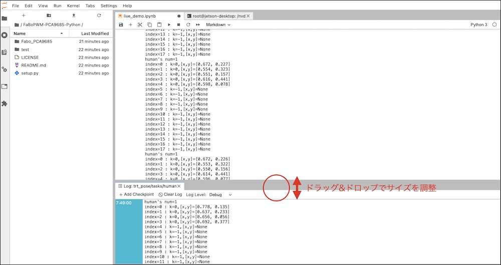

# Logを出してみる

## Logの表示

ログを表示するため、以下の黄色い領域のコードを追記します。

``` python hl_lines="7 8 9 10 11 12 13 14 15 16 17"
def execute(change):
    image = change['new']
    data = preprocess(image)
    cmap, paf = model_trt(data)
    cmap, paf = cmap.detach().cpu(), paf.detach().cpu()
    counts, objects, peaks = parse_objects(cmap, paf)#, cmap_threshold=0.15, link_threshold=0.15)
    human = objects[0][0]
    C = human.shape[0]
    print("human's num=%d" % counts[0])
    for j in range(C):
        k = int(human[j])
        if k >= 0:
            peak = peaks[0][j][k]  
            peak = (j, float(peak[0]), float(peak[1]))
            print('index=%d : k=%d,[x,y]=[%5.3f, %5.3f]'%(j, k, peak[1], peak[2]))
        else:
            print('index=%d : k=%d,[x,y]=None'%(j,k))
    draw_objects(image, counts, objects, peaks)
    image_w.value = bgr8_to_jpeg(image[:, ::-1, :])
```

## Log画面を別出しにする

viewを選択し、Show Log Consoleを選択します。



ログのタブをドラック＆ドロップします。



青い枠が表示するまで移動します。



画面が分割されログが見やすくなります。認識されてるかどうか確認しましょう。




## 参考

[https://spyjetson.blogspot.com/2019/12/jetsonnano-human-pose-estimation-using.html](https://spyjetson.blogspot.com/2019/12/jetsonnano-human-pose-estimation-using.html)

