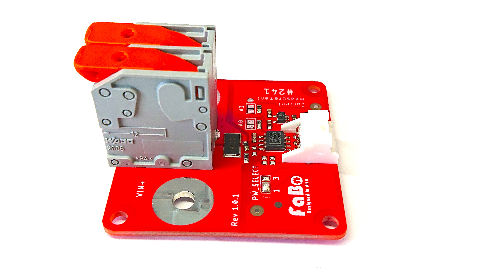

# 241 CurrentMeasurement



## 特徴

FaBoの241はINA219搭載のハイサイド測定の電流計で４スケのケーブルに対応し、スクリューレスの端子で簡単に配線できます。

## サンプルコードの動作

電流を測定できます。（３.2Aまで）
電圧　調査中

##　設定

I2Cデバイスのアドレスは最大４つ設定できます。

## サンプルコード使用時の接続
FaBo #227 を I2C0,I2C1,I2C2のいずれかに接続します。 


## Brick回路図
~画像〜

FaBoのライブラリをインストール

```sh

工事中
ご迷惑をおかけします。


```python

工事中
ご迷惑をおかけします。


```


