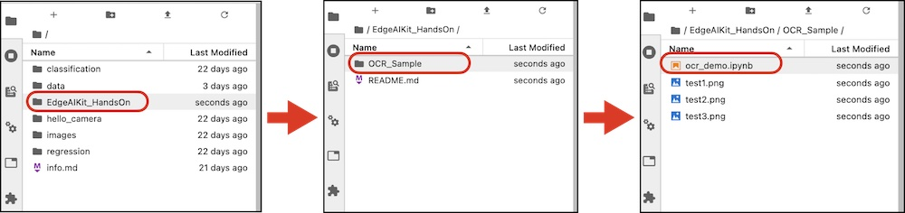
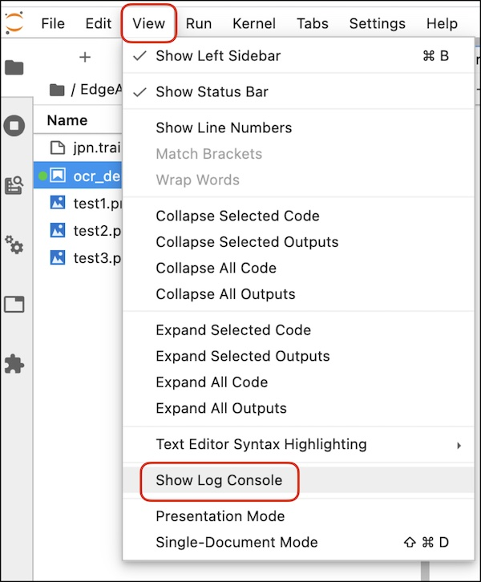
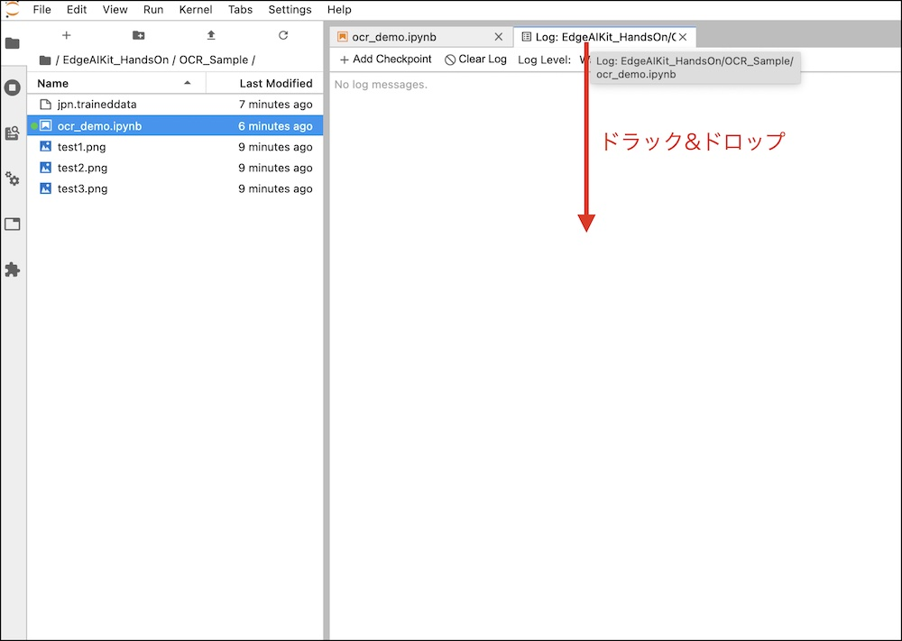
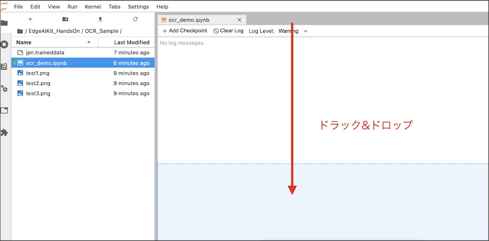

# サンプルの取得

## Notebookをgit clone

JupyterLabでTerminalを開き、下記コマンドでサンプルをCloneします。

```
cd /nvdli-nano/
git clone https://github.com/FaBoPlatform/EdgeAIKit_HandsOn
```

## demoを開く



## log consoleを開く







