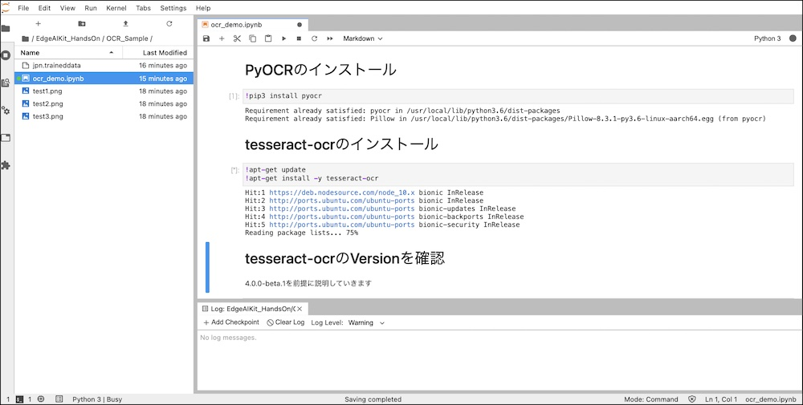

# Demoの実行

## ライブラリのインストール処理

JuputerLabのNotebookで、!をつけてコマンドを実行すると、Notebookからコマンド実行が可能です。

## 必要なもの

Autofocusに対応したカメラが必要です。

|対応したカメラ|
|:--|
|Logitech C920n|

USBカメラをJetson Nanoに接続します。

## 検出結果

検出結果はOCRボタンを押したあとに、Log Consoleに表示されます。

確認できましたら、次のページでDockerの保存をしましょう。
