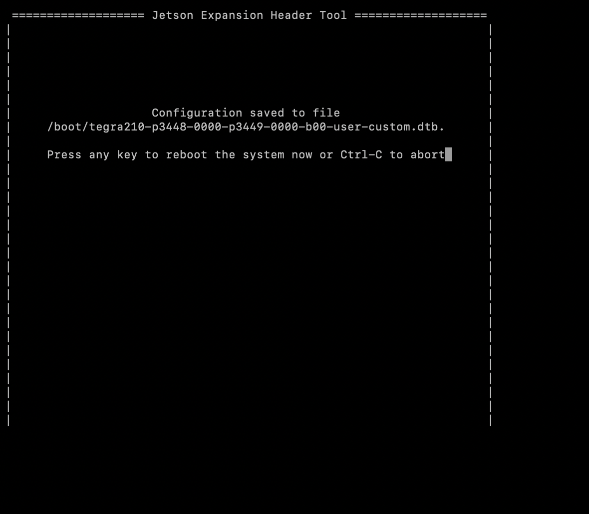

# SPIの設定

## SPIの有効化

FaBo 519 OutinSheildのアナログ計測はMCP3008を使用します。このMCP3008は、SPI1を使いますので、GPIOからSPI1のポートへ設定します。

Jupyter labからターミナルを起動して、

Jetson-IO toolを起動します。

```
$sudo /opt/nvidia/jetson-io/jetson-io.py
```

Jetson　Expansion Header Toolが起動します。


カーソルとスペースキーでSPI１を有効にします。


カーソルでEXITに合わせてエンターキーを押します。
　


カスタムDTBが作成されSPIがつかえるようになります。


再起動されます。
