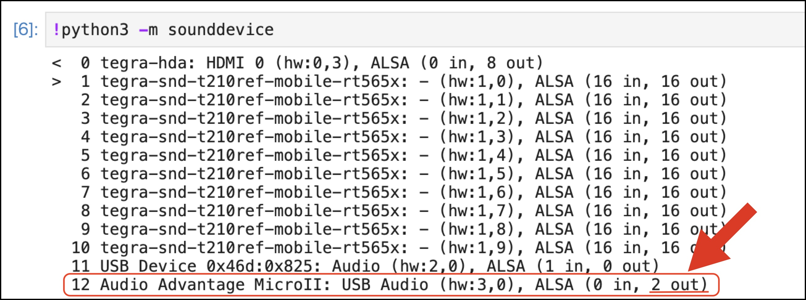

# サンプル

##ディレクトリの移動

/nvdli-nano/speak/へ移動します。

## Deviceを発見

USB Speakerを接続し、デバイスの検索をおこないます。

Jupyter labのプラスボタンをクリックして、Python3を選択し、ブロックに以下の文を入力し、再生ボタンで実行するか、Shift + Enterで実行させます。

```
!python3 -m sounddevice
```

実行するとサウンドデバイスのリストが現れ、



`12 Audio Advantage MicroII: USB Audio (hw:3,0), ALSA (0 in, 2 out)` がUSB Speakerになります。
上図のような結果から、12がUSB Speakerであることを見分けるポイントは、`2 out`の部分です。`2 out`の2の部分がSpeakerの数を示しています。12がUSB Speakerであることが明確になったので、sounddeviceで12を指定します。
USB SpeakerのOutputが見つからない場合は、JetsonのDockerをCommitした上で、Jetsonを再起動します。

※I2Sデバイスは番号は１になります。

上記リストからのUSBスピーカーデバイス番号の場合

```
sd.default.device = 12
```

I２Sデバイスのデバイス番号の場合

```
sd.default.device = 1
```

## Sampleコード

文字データから、「こんにちは」とスピーカーから音声を発生させます。

mp3ファイルの作成し、wavファイルへ変換

```Python
from gtts import gTTS
from pydub import AudioSegment

file_name = "hello"

tts = gTTS('こんにちは',lang='ja')
tts.save(file_name+".mp3")
sound = AudioSegment.from_mp3(file_name+".mp3")
sound.export(file_name+".wav", format="wav", parameters=['-ar', '48000'])
```

wavファイルを再生します。

```Python
import sounddevice as sd
import time
import soundfile as sf

sd.default.device = 12
(data, frame_rate) = sf.read(file_name+".wav")
print(sf)
sd.play(data, frame_rate)
sd.wait()
```

## 関数化

上記コードを関数化し、使いやすくします。

```Python
from gtts import gTTS
from pydub import AudioSegment
import sounddevice as sd
import time
import soundfile as sf

def make_speak(file_name, word):
    tts = gTTS(word,lang='ja')
    tts.save(file_name+".mp3")
    sound = AudioSegment.from_mp3(filename+".mp3")
    sound.export(file_name+".wav", format="wav", parameters=['-ar', '48000'])

def speak(file_name):
    sd.default.device = 12
    (data, frame_rate) = sf.read(file_name+".wav")
    print(sf)
    sd.play(data, frame_rate)
    sd.wait()

make_speak("hello", "おはようございます、朝です")
speak("hello")
```

つぎのページでDockerの保存をしましょう。
