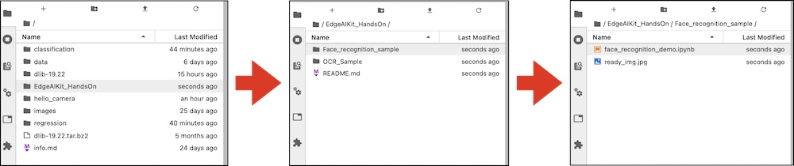

# Demoの実行

## Notebookをgit clone

JupyterLabでTerminalを開き、下記コマンドでサンプルをgithubよりダウンロード(Clone)
します。

```
cd /nvdli-nano/
```
```
git clone https://github.com/FaBoPlatform/EdgeAIKit_HandsOn
```

## Demoの実行

ダウンロードが完了しましたら、
~/EdgeAIKit_HandsOn/Face_recognition_sample/に移動し、Face_recognition_demo.ipynbを開きます。



 動作確認ができましたら、つぎのページでDockerの保存をしましょう。
