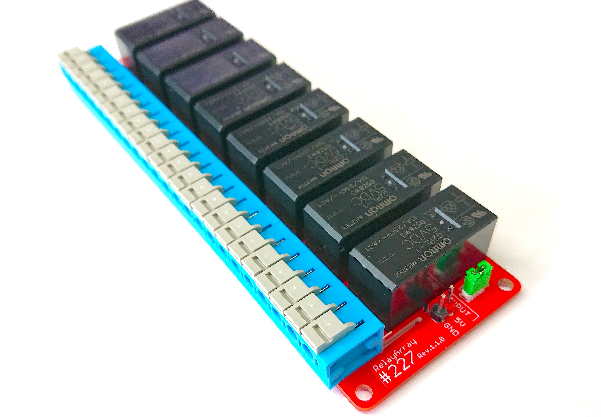

# 227 relayArray



## 特徴
8チャンネルリレー

FaBoの227リレーは８個のリレーと搭載しておりomron G2RL-1 5VDCを採用しております。
大電流（１０A）を流すことができます。また、インターフェースはI2Cでありスマートに配線できます。スクリーレスターミナルブロック により、ドライバーなしでさっと配線。

## サンプルコードの動作
リレーアレイのリレーを順番にONさせていきます。
リレーを同時に使うときは、ジャンパー線をはずして、外部電源（DC５V）が必要となります。
※絶対に極性を間違えないでください。


## サンプルコード使用時の接続
FaBo #227 を I2C0,I2C1,I2C2のいずれかに接続します。 


## Brick回路図
~画像〜

FaBoのライブラリをインストール

```sh
$git clone https://github.com/FaBoPlatform/FaBoGPIO-PCAL6408-Python.git
$cd FaBoGPIO-PCAL6408-Python
$sudo pip3 install .
```

リレーの動作チェックします。
リレーの動作は、アティブローになりますのでご注意ください。

```python

import FaBoGPIO_PCAL6408
import time
import sys

BUSNUM=1
pcal6408 = FaBoGPIO_PCAL6408.PCAL6408(busnum=BUSNUM)

pcal6408.setDigital(0xFF, 1)   #すべてOFF
time.sleep(1)

try:
    while True:
            
        #順番にリレーON
        for i in range(8):
            pcal6408.setDigital(0x01<<i, 0)
            time.sleep(1)
            pcal6408.setDigital(0x01<<i, 1)
            time.sleep(1)
        
        time.sleep(2)
        #すべてON
        pcal6408.setDigital(0xFF, 0)
        time.sleep(3)
        #すべてOFF
        pcal6408.setDigital(0xFF, 1)
        time.sleep(3)
            
        #順次にリレーをON
        for i in range(9):
            pcal6408.setDigital((2 ** i)-1, 0)
            time.sleep(1)
            pcal6408.setDigital((2 ** i)-1, 1)
            time.sleep(1)
        
        #リレー全数オンオフテスト
        for i in range(5):
            pcal6408.setDigital(0xFF, 1)
            time.sleep(1)
            pcal6408.setDigital(0xFF, 0)
            time.sleep(1)
            
        #すべてOFF
        pcal6408.setDigital(0xFF, 1)
        
except KeyboardInterrupt:
    pcal6408.setAllClear()
    sys.exit()

```


