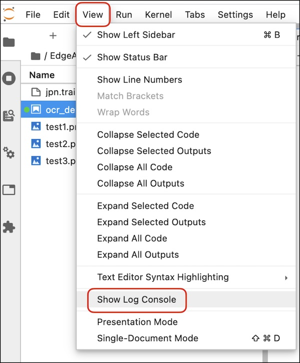
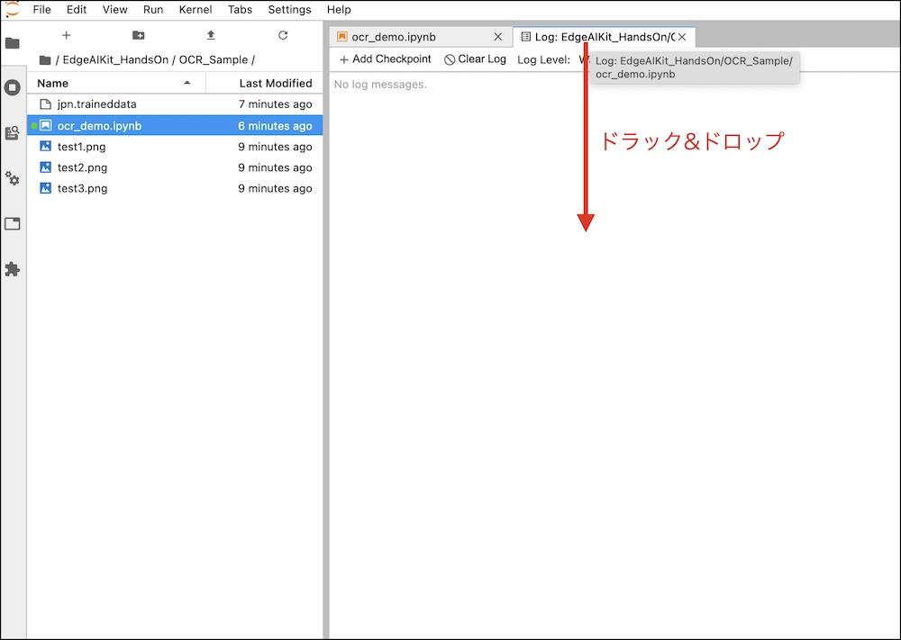

# サンプルの取得

## Notebookをgit clone

JupyterLabでTerminalを開き、下記コマンドでサンプルをCloneします。

```
cd /nvdli-nano/
```
```
git clone https://github.com/FaBoPlatform/EdgeAIKit_HandsOn
```

## demoを開く

~/EdgeAIKit/OCR_sample/に移動し、ocr_demo.ipynbを開きます。


## log consoleを開く

viewにあるShow Log Consoleでログを見やすくします。



Logのタブを下へドラッグ＆ドロップします。



コードとログで画面を２分割します。


