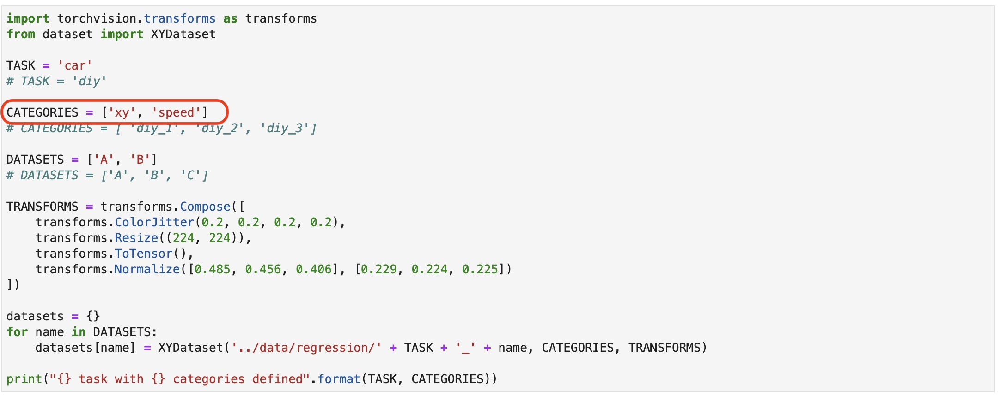
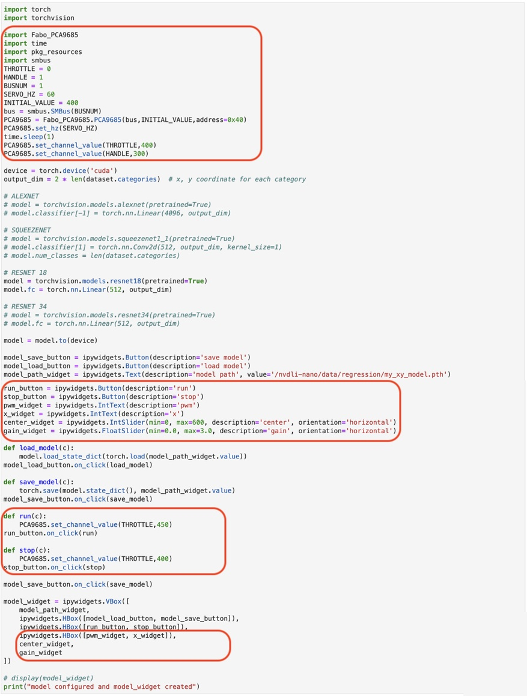
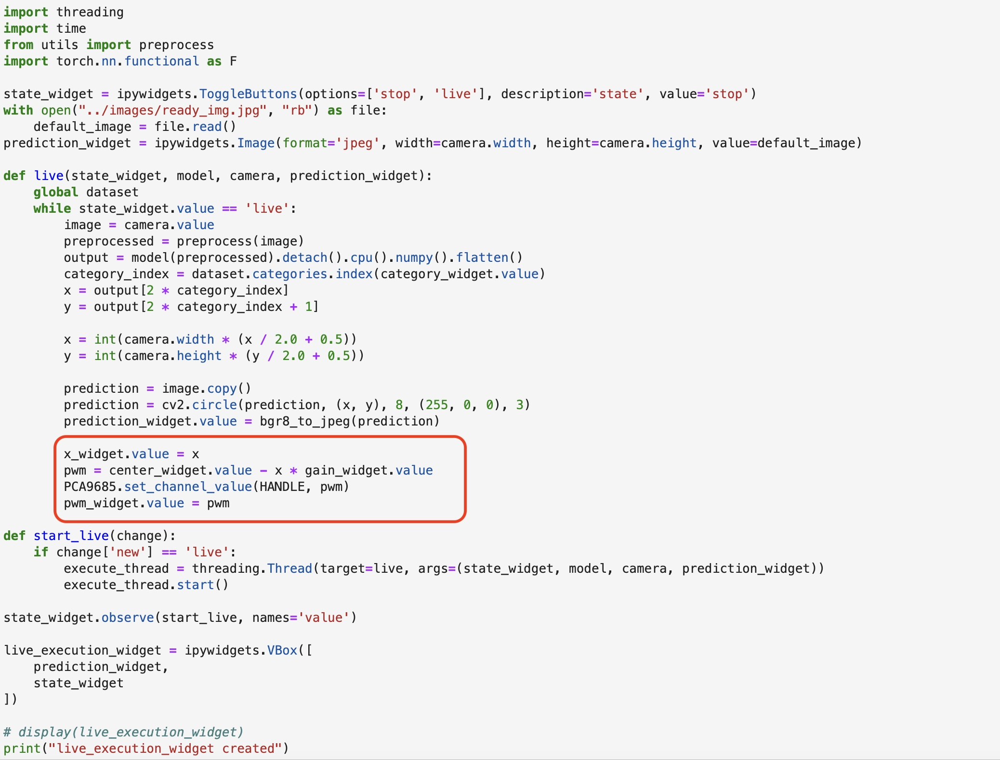

# ServoとAIの連携(回帰)

## カテゴリ名の修正



```
import torchvision.transforms as transforms
from dataset import XYDataset

TASK = 'car'
# TASK = 'diy'

CATEGORIES = ['xy', 'speed']
# CATEGORIES = [ 'diy_1', 'diy_2', 'diy_3']

DATASETS = ['A', 'B']
# DATASETS = ['A', 'B', 'C']

TRANSFORMS = transforms.Compose([
    transforms.ColorJitter(0.2, 0.2, 0.2, 0.2),
    transforms.Resize((224, 224)),
    transforms.ToTensor(),
    transforms.Normalize([0.485, 0.456, 0.406], [0.229, 0.224, 0.225])
])

datasets = {}
for name in DATASETS:
    datasets[name] = XYDataset('../data/regression/' + TASK + '_' + name, CATEGORIES, TRANSFORMS)
    
print("{} task with {} categories defined".format(TASK, CATEGORIES))
```

## ボタンと処理の追加



```
import torch
import torchvision

import Fabo_PCA9685
import time
import pkg_resources
import smbus
THROTTLE = 0
HANDLE = 1
BUSNUM = 1
SERVO_HZ = 60
INITIAL_VALUE = 400
bus = smbus.SMBus(BUSNUM)
PCA9685 = Fabo_PCA9685.PCA9685(bus,INITIAL_VALUE,address=0x40)
PCA9685.set_hz(SERVO_HZ)
time.sleep(1)
PCA9685.set_channel_value(THROTTLE,400)
PCA9685.set_channel_value(HANDLE,300)

device = torch.device('cuda')
output_dim = 2 * len(dataset.categories)  # x, y coordinate for each category

# ALEXNET
# model = torchvision.models.alexnet(pretrained=True)
# model.classifier[-1] = torch.nn.Linear(4096, output_dim)

# SQUEEZENET 
# model = torchvision.models.squeezenet1_1(pretrained=True)
# model.classifier[1] = torch.nn.Conv2d(512, output_dim, kernel_size=1)
# model.num_classes = len(dataset.categories)

# RESNET 18
model = torchvision.models.resnet18(pretrained=True)
model.fc = torch.nn.Linear(512, output_dim)

# RESNET 34
# model = torchvision.models.resnet34(pretrained=True)
# model.fc = torch.nn.Linear(512, output_dim)

model = model.to(device)

model_save_button = ipywidgets.Button(description='save model')
model_load_button = ipywidgets.Button(description='load model')
model_path_widget = ipywidgets.Text(description='model path', value='/nvdli-nano/data/regression/my_xy_model.pth')

run_button = ipywidgets.Button(description='run')
stop_button = ipywidgets.Button(description='stop')
pwm_widget = ipywidgets.IntText(description='pwm')
x_widget = ipywidgets.IntText(description='x')
center_widget = ipywidgets.IntSlider(min=0, max=600, description='center', orientation='horizontal')
gain_widget = ipywidgets.FloatSlider(min=0.0, max=3.0, description='gain', orientation='horizontal')

def load_model(c):
    model.load_state_dict(torch.load(model_path_widget.value))
model_load_button.on_click(load_model)
    
def save_model(c):
    torch.save(model.state_dict(), model_path_widget.value)
model_save_button.on_click(save_model)

def run(c):
    PCA9685.set_channel_value(THROTTLE,450)
run_button.on_click(run)

def stop(c):
    PCA9685.set_channel_value(THROTTLE,400)
stop_button.on_click(stop)

model_save_button.on_click(save_model)

model_widget = ipywidgets.VBox([
    model_path_widget,
    ipywidgets.HBox([model_load_button, model_save_button]),
    ipywidgets.HBox([run_button, stop_button]),
    ipywidgets.HBox([pwm_widget, x_widget]),
    center_widget,
    gain_widget
])

# display(model_widget)
print("model configured and model_widget created")
```

## 推論結果でサーボを制御



```
import threading
import time
from utils import preprocess
import torch.nn.functional as F

state_widget = ipywidgets.ToggleButtons(options=['stop', 'live'], description='state', value='stop')
with open("../images/ready_img.jpg", "rb") as file:
    default_image = file.read()
prediction_widget = ipywidgets.Image(format='jpeg', width=camera.width, height=camera.height, value=default_image)

def live(state_widget, model, camera, prediction_widget):
    global dataset
    while state_widget.value == 'live':
        image = camera.value
        preprocessed = preprocess(image)
        output = model(preprocessed).detach().cpu().numpy().flatten()
        category_index = dataset.categories.index(category_widget.value)
        x = output[2 * category_index]
        y = output[2 * category_index + 1]
        
        x = int(camera.width * (x / 2.0 + 0.5))
        y = int(camera.height * (y / 2.0 + 0.5))
        
        prediction = image.copy()
        prediction = cv2.circle(prediction, (x, y), 8, (255, 0, 0), 3)
        prediction_widget.value = bgr8_to_jpeg(prediction)
        
        x_widget.value = x 
        pwm = center_widget.value - x * gain_widget.value
        PCA9685.set_channel_value(HANDLE, pwm)
        pwm_widget.value = pwm
            
def start_live(change):
    if change['new'] == 'live':
        execute_thread = threading.Thread(target=live, args=(state_widget, model, camera, prediction_widget))
        execute_thread.start()

state_widget.observe(start_live, names='value')

live_execution_widget = ipywidgets.VBox([
    prediction_widget,
    state_widget
])

# display(live_execution_widget)
print("live_execution_widget created")
```