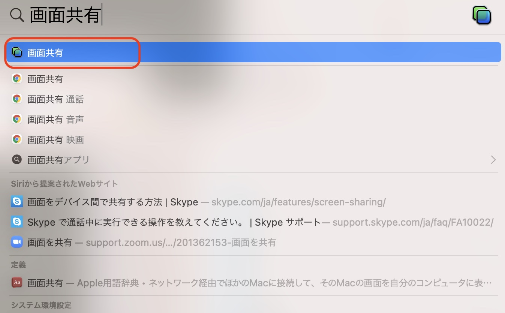
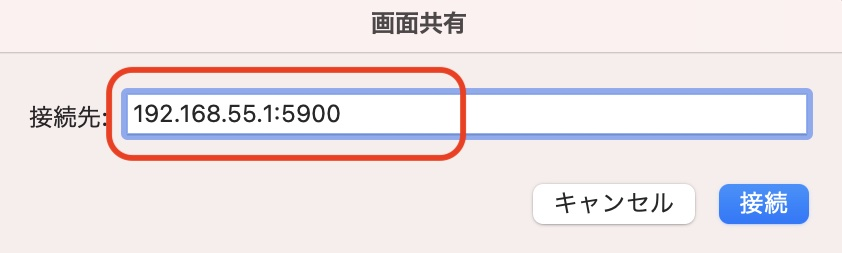

# VNC

## JetsonのVNCのインストール

```
mkdir -p ~/.config/autostart
cp /usr/share/applications/vino-server.desktop ~/.config/autostart/.
```

```
cd /usr/lib/systemd/user/graphical-session.target.wants
sudo ln -s ../vino-server.service ./.
```

```
gsettings set org.gnome.Vino prompt-enabled false
gsettings set org.gnome.Vino require-encryption false
```

## X-Windowsのサイズ

```
sudo vim /etc/X11/xorg.conf
```

```
Section "Screen"
   Identifier    "Default Screen"
   Monitor       "Configured Monitor"
   Device        "Tegra0"
   SubSection "Display"
       Depth    24
       Virtual 1280 800 # Modify the resolution by editing these values
   EndSubSection
EndSection
```

## VNC service

|VNC|OS|URL|
|:--|:--|:--|
|VNC® Viewer | Windows|[https://www.realvnc.com/en/connect/download/viewer/](https://www.realvnc.com/en/connect/download/viewer/) |
|画面共有|OSX|画面共有|


## 接続先





## 参考

[https://developer.nvidia.com/embedded/learn/tutorials/vnc-setup](https://developer.nvidia.com/embedded/learn/tutorials/vnc-setup)