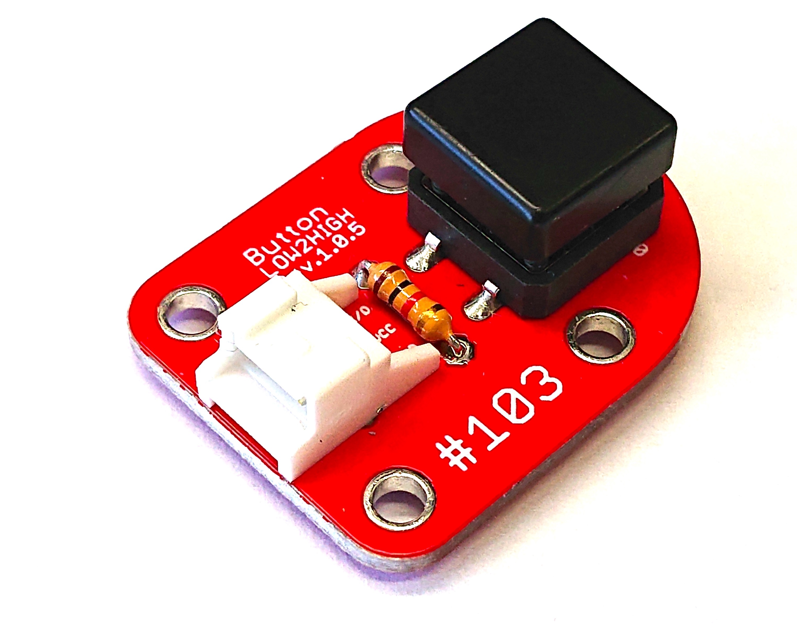
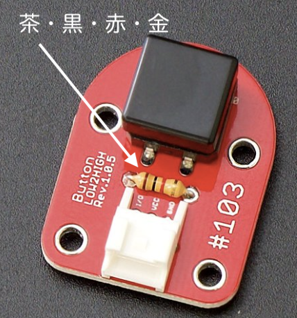

# Button



## 注意

＃FaBo 103 button は、抵抗が１Kのものをご使用ください。
茶、黒、赤、金（１０２）



## 接続

GPIOは4,5,6,12,13,16


FaBo #103 BUTTON Brickを使用してボタンがおしたら、LED点灯させます。
LED BrickをGPIO４に接続、BUTTON Brickは、GPIO5に接続します。


GPIOの判定

以下のコードは、ボタンが押されたのたえずチェックします。

```python
# coding: utf-8
import Jetson.GPIO as GPIO
import sys

LEDPIN = 4
BUTTONPIN = 5

GPIO.setmode(GPIO.BCM)
GPIO.setup(LEDPIN, GPIO.OUT)
GPIO.setup(BUTTONPIN, GPIO.IN)

try:
    while True:
        # ボタン押下判定
        if( GPIO.input(BUTTONPIN)):
            # LED点灯
            GPIO.output(LEDPIN, True)
        else:
            # LED消灯
            GPIO.output(LEDPIN, False)
except KeyboardInterrupt:
    GPIO.cleanup()
    sys.exit(0)
```


GPIOの入力待ち

以下のコードはボタンがおされるまで待っています。

```
# coding: utf-8
import Jetson.GPIO as GPIO
import sys

LEDPIN = 4
BUTTONPIN = 5

GPIO.setmode(GPIO.BCM)
GPIO.setup(LEDPIN, GPIO.OUT)
GPIO.setup(BUTTONPIN, GPIO.IN)

try:
    while True:
		GPIO.wait_for_edge(BUTTONPIN, GPIO.FALLING)
		print("Button Pressed!")
		GPIO.output(LEDPIN, GPIO.HIGH)
		time.sleep(1)
		GPIO.output(LEDPIN, GPIO.LOW)

except KeyboardInterrupt:
    GPIO.cleanup()
    sys.exit(0)
```

イベントとして取得

以下のコードは、処理中にボタンがおされたら、現在の処理を停止して、関数blinkを呼び、その関数の処理がおわったら、blink呼び出し前に戻ります。

```
# coding: utf-8
import Jetson.GPIO as GPIO
import sys

LEDPIN = 4
BUTTONPIN = 5

GPIO.setmode(GPIO.BCM)
GPIO.setup(LEDPIN, GPIO.OUT)
GPIO.setup(BUTTONPIN, GPIO.IN)

# blink LED 
def blink(channel):
    for i in range(5):
        GPIO.output(LEDPIN, GPIO.HIGH)
        time.sleep(0.5)
        GPIO.output(LEDPIN, GPIO.LOW)
        time.sleep(0.5)

GPIO.add_event_detect(BUTTONPIN, GPIO.FALLING, callback=blink, bouncetime=10)

try:
    while True:
    	print("Loop")
		time.sleep(1)

except KeyboardInterrupt:
    GPIO.cleanup()
    sys.exit(0)
```
