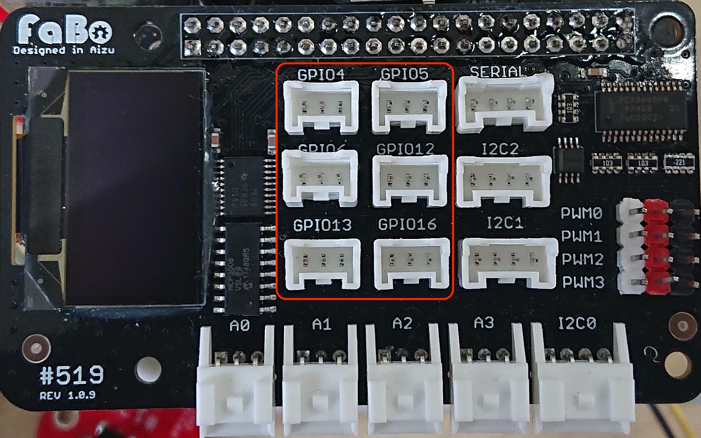

# 110 Tilt

FaBo #110 Tilt Brickを使用して傾斜を検知します。

GPIOは4,5,6,12,13,16




```
import RPi.GPIO as GPIO
import sys

LED_PIN = 4
TILT_PIN = 5

GPIO.setmode(GPIO.BCM)
GPIO.setup(LED_PIN, GPIO.OUT)
GPIO.setup(TILT_PIN, GPIO.IN)

try:
    while True:
        if(GPIO.input(TILT_PIN)):
            GPIO.output(LED_PIN, True)
        else:
            GPIO.output(LED_PIN, False)

except KeyboardInterrupt:
    GPIO.cleanup()
    sys.exit()
```
