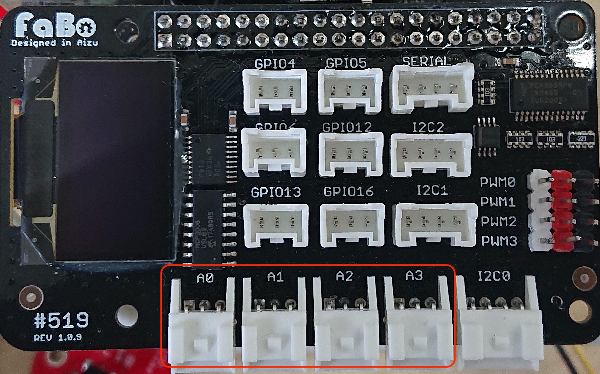

# 114 UV


## サンプルコードの動作
FaBo #114 UVを使用して１秒ごとに紫外線強度を計測します。

## サンプルコード使用時の接続
A0にAnalog Brickを接続します。




## JETSON NANO GPIO40ピン
| ピン番号 |  Jetson.GPIO番号  |  NAME  | ピン番号 |  Jetson.GPIO番号  |  NAME  |
| :---: | :---: |---- | :---: | :---: |---- |
|  1  | - |  3.3V  | 2 | - |  5V  |
|  3  | 2 |  I2C_2_SDA  | 4  | - |  5V  |
|  5  | 3 |  I2C_2_SCL  | 6  | - |  GND  |
|  7  | 4 |  AUDIO_MCLK  | 8 | 14 |  UART_2_TX  |
|  9  | - |  GND  | 10  | 15 |  UART_2_RX  |
|  11  | 17 |  UART_2_RTS  | 12  | 18 |  I2S_4_SCLK  |
|  13  | 27 |  SPI_2_SCK  | 14  | - |  GND  |
|  15 | 22 |  LCD_TE  | 16  | 23 |  SPI_2_CS1  |
|  17  | - |  3.3V  | 18  | 24 |  SPI_2_CS0  |
|  19  | 10 |  SPI_1_MOSI  | 20  | - |  GND  |
|  21  | 9 |  SPI_1_MISO  | 22  | 25 |  SPI_2_MISO  |
|  23  | 11 |  SPI_1_SCK  | 24  | 8 |  SPI_1_CS0  |
|  25  | - |  GND  | 26  | 7 |  SPI_1_CS1  |
|  27  | - |  I2C_1_SDA  | 28  | - |  I2C_1_SCL  |
|  29  | 5 |  CAM_AF_EN  | 30  | - |  GND  |
|  31  | 6 |  GPIO_OZ0  | 32  | 12 |  LCD_BL_PWM  |
|  33  | 13 |  GPIO_PE6  | 34  |  - |  GND  |
|  35  | 19 |  I2S_4_LRCK  | 36  | 16 |  UART_2_CTS  |
|  37  | 26 |  SPI_2_MOSI  | 38  | 20 |  I2S_4_SDIN  |
|  39  | - |  GND  | 40  | 21 |  I2S_4_SDOUT  |

## Brick回路図


紫外線センサーには、G6262使用
紫外線強度により増幅度を選択します。
紫外線強度が増加すると数値が上昇します。


<br>

```python

# coding: utf-8
import Jetson.GPIO as GPIO
import spidev
import time
import sys

# A0コネクタにAngleを接続
ANGLEPIN = 0

#######################################################################
def readadc(channel):
    """
    Analog Data Converterの値を読み込む
    @channel チャンネル番号
    """
    adc = spi.xfer2([1,(8+channel)<<4,0])
    data = ((adc[1]&3) << 8) + adc[2]
    return data

#######################################################################
def map(x, in_min, in_max, out_min, out_max):
    """
    map関数
    @x 変換したい値
    @in_min 変換前の最小値
    @in_max 変換前の最大値
    @out_min 変換後の最小
    @out_max 変換後の最大値
    @return 変換された値
    """
    return (x - in_min) * (out_max - out_min) // (in_max - in_min) + out_min

# 初期化
spi = spidev.SpiDev()
spi.open(0,0)
spi.max_speed_hz = 5000

try:
    while True:
        data = readadc(ANGLEPIN)
        print("UV : {:8} ".format(data))
        time.sleep(1)
except KeyboardInterrupt:
    GPIO.cleanup()
    spi.close()
    sys.exit(0)

```
