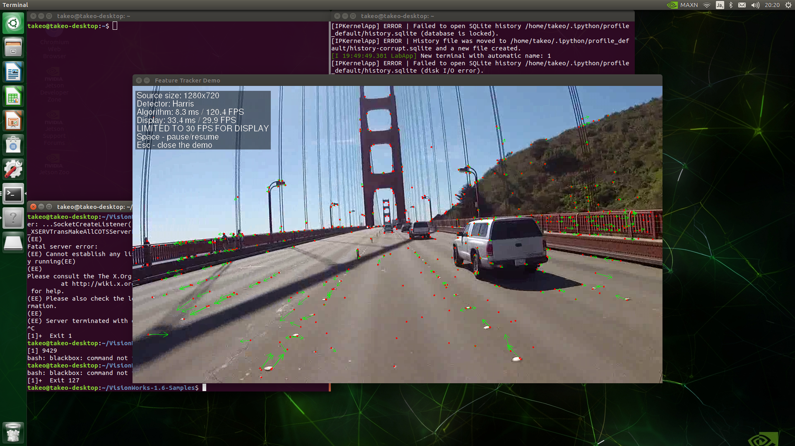

# デモ

JetPackには、サンプルが用意されております。ここでは、その一部を紹介します。

## VisionWorks1.6


jupyter labのターミナルを選択し、以下を入力。

```sh
$cd /usr/share/visionworks/sources
```

```sh
$ls

3rdparty
data
demos
install-samples.sh
Makefile
nvxio
samples
user_guide_linux.md
```

サンプルガイド詳細
```sh
$cat user_guide_linux.md
```

```sh
$ /usr/share/visionworks/sources/install-samples.sh ~/
```

実行結果
```sh
~/es.sh ~
Creating the /home/takeo//VisionWorks-1.6-Samples directory...
Copying VisionWorks samples to /home/takeo//VisionWorks-1.6-Samples...
Finished copying VisionWorks samples
```

Makefileがあるところまで移動
```sh
$cd /home/takeo/VisionWorks-1.6-Samples
```

ビルドします。
```sh
$ make -j4 # add dbg=1 to make debug build
```

実行結果（抜粋 最後の部分）
```
make[1]: Leaving directory '/home/takeo/VisionWorks-1.6-Samples/samples/object_tracker_nvxcu'
make[1]: Leaving directory '/home/takeo/VisionWorks-1.6-Samples/samples/opencv_npp_interop'
```

実行ファイルができます。
```sh
$/home/takeo/VisionWorks-1.6-Samples/bin/aarch64/linux/releas
```

デモファイル一覧
```sh
$ls
nvx_demo_feature_tracker        
nvx_demo_stereo_matching         
nvx_sample_opencv_npp_interop
nvx_demo_feature_tracker_nvxcu  
nvx_demo_video_stabilizer        
nvx_sample_opengl_interop
nvx_demo_hough_transform        
nvx_sample_nvgstcamera_capture   
nvx_sample_player
nvx_demo_motion_estimation      
nvx_sample_object_tracker_nvxcu
```

デモファイル実行します。
```sh
$ ./nvx_demo_feature_tracker
```

デモが実行されるとログが表示され検出された特徴点の数と検出時間が表示されます。


デモが実行された様子がHDMI機器に表示されます。
特徴点を追跡しています。




Vision works
https://developer.nvidia.com/embedded/visionworks
