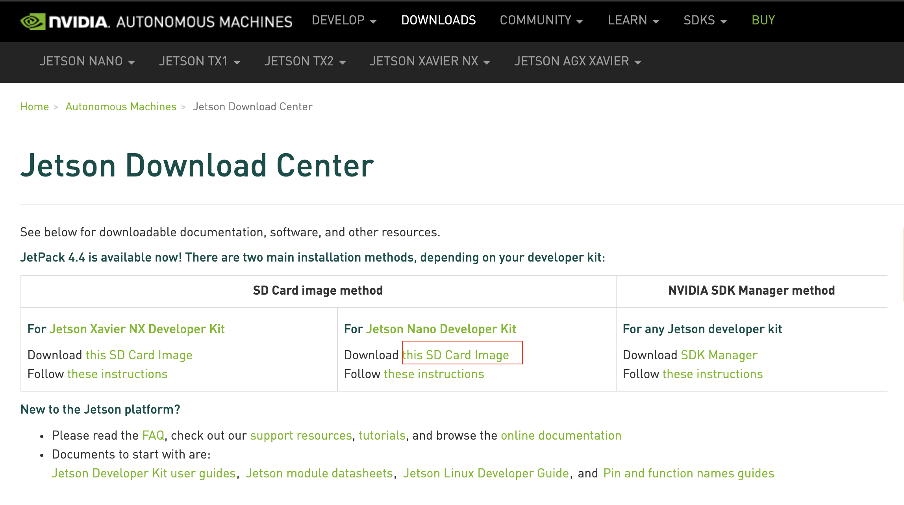

# SDカード作成

こちらではSDカードの作り方を説明いたします。実際、授業では時間が少なくかぎられていますので、設定済みのファイルイメージをダウンロードすることをお勧めいたします。

イメージダウンロード先

JetsonDownloadCenter

https://developer.nvidia.com/embedded/learn/get-started-jetson-nano-devkit#write



this SD Card Imageからダウンロード。

ダウンロードしたら解凍します。


Window 

mac

linux

JetsonにSDカードを挿入し、ディスプレイ、キーボード、マウスを差して、電源を投入します。

WIfi設定

時間設定

キーボード設定


パッケージを最新の状態にします。
```
$sudo apt-get update

$sudo apt-get upgrade

$sudo reboot
```


