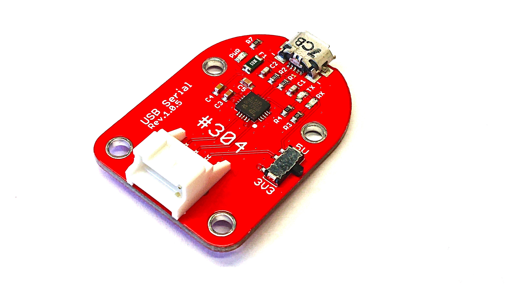

# 304 USBserial



## サンプルコードの動作
FaBo USB Serialを使いUARTで通信いたします。

## サンプルコード使用時の接続
FaBo #2 を SERIALに接続します。


※注意　信号レベルは3.3Vになります。デフォルトでは、SERIALピンのVCC（５V）からは給電されません。


## Brick回路図

~画像〜

```
#sudo chmod 666 /dev/ttyTHS1でアクセス権を与る。
import serial
```

```
# /dev/ttyTHS1でボーレート115200、パリティビットなしで設定
ser = serial.Serial("/dev/ttyTHS1", baudrate=115200 ,parity=serial.PARITY_NONE)

# ノイズデータがある場合があるのでバッファをクリアする
ser.reset_input_buffer()


# シリアル通信もバイナリ形式で送る
ser.write(b"RECEIVE:hello FaBo 2020 Press any 10-character keyboard\r\n")
print("send: hello FaBo 2020 Press any 10-character keyboard.")

# 受け取ったデータもバイナリ形式
# 引数は受け取る文字数
recv_data = ser.read(10)
print(recv_data)

print("send: TestEnd")
ser.write(recv_data)
ser.write(b"\r\nRECEIVE:TEST END")

```

```

## バーストテスト

import serial
import time
from time import localtime

# /dev/ttyTHS1でボーレート115200、パリティビットなしで設定
ser = serial.Serial("/dev/ttyTHS1", baudrate=115200 ,parity=serial.PARITY_NONE)

# ノイズデータがある場合があるのでバッファをクリアする
ser.reset_input_buffer()


# シリアル通信もバイナリ形式で送る
for w in range(255):
    ser.write(b"RECEIVE:hello world! FaBo 2020-2021-2\r\n")

ser.close()

```

```
#１００文字を入力して送信して表示する。QWERT入力確認
import serial

# /dev/ttyTHS1でボーレート115200、パリティビットなしで設定
ser = serial.Serial("/dev/ttyTHS1", baudrate=115200 ,parity=serial.PARITY_NONE)

# ノイズデータがある場合があるのでバッファをクリアする
ser.reset_input_buffer()

ser.write(b"INPUT CHAR.\r\n")

# 受け取ったデータもバイナリ形式
# 引数は受け取る文字数
for w in range(100):
    recv_data = ser.read(1)
    ser.write(recv_data)
    
ser.write(b"TEST END.\r\n")
    
ser.close()
```
